# Muster architecture

- Status: Draft
- Date: 2026-10-03

This document draws the architecture of Muster's first release (L1) from the accepted [ADRs](adr/README.md) and the
approved [product requirements](prd/README.md). It adds no decisions of its own: every box and arrow points back to an
ADR, which says why, or to a capability `C-NN`, which says what. Capitalized terms follow the glossary in
[`CONTEXT.md`](../CONTEXT.md); [section 7](#7-architecture-terms) explains the few engineering terms that are not domain
terms. The diagrams are Mermaid and render on GitHub. The data model of [section 6](#6-conceptual-data-model) is
conceptual: the physical schema is designed next.

Contents: [1. System context](#1-system-context) · [2. Containers](#2-containers) · [3. Components](#3-components) ·
[4. Key flows](#4-key-flows) · [5. State machines](#5-state-machines) ·
[6. Conceptual data model](#6-conceptual-data-model) · [7. Architecture terms](#7-architecture-terms)

---

## 1. System context

Muster sits after Alertmanager and does not replace it ([ADR-0002]). Rule evaluators — Prometheus or vmalert — fire
alerts into Alertmanager, which keeps inhibition, the deduplication of redundant evaluators and Alertmanager silences.
Each Alertmanager cluster, usually an HA pair, is one Integration ([C-05]): an Alertmanager receiver sends its
Snapshots to Muster's ingestion endpoint, and a second receiver on a dedicated Alertmanager route sends an always-firing
`Watchdog` alert as the Integration's Heartbeat ([C-07]). Muster needs no inbound access to Alertmanager.

Muster delivers Alert Groups to Mattermost through its REST API with a bot account, and Mattermost calls Muster back
when someone presses a button ([ADR-0013], [C-13]). It delivers to Telegram through the Bot API — at
`api.telegram.org`, behind a reverse proxy or on a self-hosted Bot API server — and receives updates by long polling or
by webhook ([C-14], [ADR-0015]). Outgoing webhooks reach any HTTP endpoint ([C-15]). People use the web UI in a browser,
and automation uses the same API with tokens ([ADR-0008], [C-04]); sign-in may go through an OIDC identity provider,
which Muster reaches over the back channel ([C-03]).

Muster is watched on two paths that bypass it ([ADR-0014], [C-19]): Prometheus or VictoriaMetrics scrapes its metrics
and evaluates the chart's alert rules, whose critical rules take an Alertmanager route that does not lead to Muster; and
the Leader sends an outgoing heartbeat to an external dead man's switch, which notices when Muster — or the whole
cluster that runs it — stops.

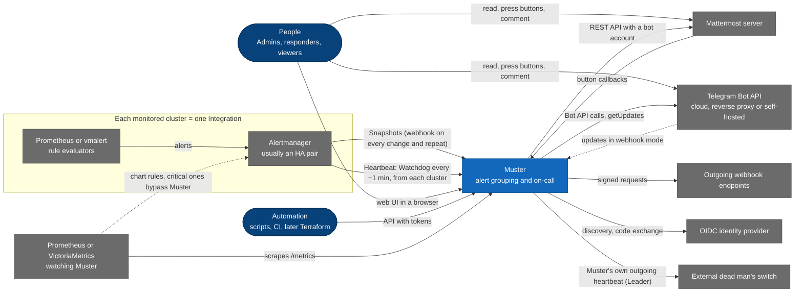
```mermaid
flowchart LR
    people(["People<br/>Admins, responders, viewers"])
    automation(["Automation<br/>scripts, CI, later Terraform"])

    subgraph cluster["Each monitored cluster = one Integration"]
        evaluators["Prometheus or vmalert<br/>rule evaluators"]
        am["Alertmanager<br/>usually an HA pair"]
    end

    muster["Muster<br/>alert grouping and on-call"]

    mm["Mattermost server"]
    tg["Telegram Bot API<br/>cloud, reverse proxy or self-hosted"]
    hooks["Outgoing webhook endpoints"]
    idp["OIDC identity provider"]
    dms["External dead man's switch"]
    mon["Prometheus or VictoriaMetrics<br/>watching Muster"]

    evaluators -- "alerts" --> am
    am -- "Snapshots (webhook on every change and repeat)" --> muster
    am -- "Heartbeat: Watchdog every ~1 min, from each cluster" --> muster
    people -- "web UI in a browser" --> muster
    automation -- "API with tokens" --> muster
    people -- "read, press buttons, comment" --> mm
    people -- "read, press buttons, comment" --> tg
    muster -- "REST API with a bot account" --> mm
    mm -- "button callbacks" --> muster
    muster -- "Bot API calls, getUpdates" --> tg
    tg -. "updates in webhook mode" .-> muster
    muster -- "signed requests" --> hooks
    muster -- "discovery, code exchange" --> idp
    muster -- "Muster's own outgoing heartbeat (Leader)" --> dms
    mon -- "scrapes /metrics" --> muster
    mon -. "chart rules, critical ones bypass Muster" .-> am

    classDef person fill:#08427b,stroke:#052e56,color:#ffffff
    classDef system fill:#1168bd,stroke:#0b4884,color:#ffffff
    classDef external fill:#6b6b6b,stroke:#4d4d4d,color:#ffffff
    class people,automation person
    class muster system
    class evaluators,am,mm,tg,hooks,idp,dms,mon external
```

| Neighbour | Direction | What travels | Reference |
|---|---|---|---|
| Alertmanager | in | Snapshots (`POST`, Integration token), Heartbeat signals | [ADR-0002], [C-05], [C-07] |
| Mattermost | out and in | posts, edits, direct messages and ephemeral replies through the REST API; button callbacks to `MUSTER_INGEST_URL` | [ADR-0013], [C-13] |
| Telegram | out (and in) | Bot API calls; updates by `getUpdates` on the Leader, or by webhook to `MUSTER_INGEST_URL` | [ADR-0007], [C-14] |
| Outgoing webhook endpoints | out | events or templated requests, signed with each Destination's Signing secret | [ADR-0005], [ADR-0011], [C-15] |
| OIDC identity provider | out | discovery, key sets, code exchange, background re-checks of OIDC users with their offline tokens; the browser is redirected to it | [C-03] |
| External dead man's switch | out | the outgoing heartbeat, once a minute, from the Leader only | [ADR-0014], [C-19] |
| Prometheus or VictoriaMetrics | in | scrapes of `/metrics` on the internal listener; pull only | [ADR-0014], [C-19] |

Every outbound arrow goes through one outbound HTTP package with the outbound address policy and, where configured, a
per-client proxy ([ADR-0015]).

---

## 2. Containers

Muster is one Go binary and one PostgreSQL database ([ADR-0006], [ADR-0009]). Every replica runs the same process: three
HTTP listeners ([C-02].FR-3), the single-page UI embedded with `go:embed`, and the background workers — Snapshot
processing, delivery and timers — on every replica, while one replica at a time is also the Leader ([ADR-0007]). The
same binary carries the CLI subcommands for emergencies, bootstrap and diagnostics (`muster migrate`, `muster doctor`,
`muster ingest replay`, `muster admin …`, `muster secrets rotate-key`), which work on the database directly
([ADR-0010]); the Helm chart runs `muster migrate` in an init container.

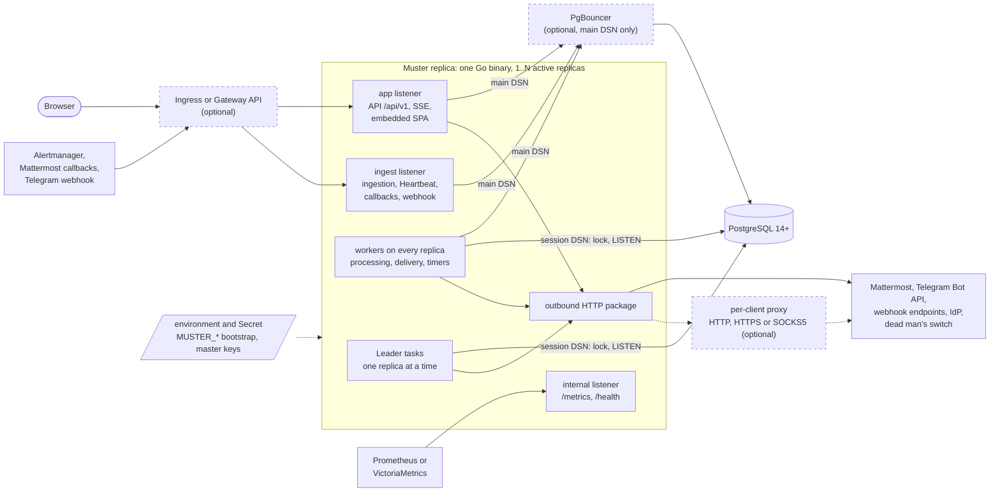
```mermaid
flowchart LR
    browser(["Browser"])
    senders["Alertmanager,<br/>Mattermost callbacks,<br/>Telegram webhook"]
    mon["Prometheus or<br/>VictoriaMetrics"]
    ingress["Ingress or Gateway API<br/>(optional)"]

    subgraph replica["Muster replica: one Go binary, 1..N active replicas"]
        app["app listener<br/>API /api/v1, SSE,<br/>embedded SPA"]
        ingest["ingest listener<br/>ingestion, Heartbeat,<br/>callbacks, webhook"]
        internal["internal listener<br/>/metrics, /health"]
        workers["workers on every replica<br/>processing, delivery, timers"]
        leader["Leader tasks<br/>one replica at a time"]
        outbound["outbound HTTP package"]
    end

    pgb["PgBouncer<br/>(optional, main DSN only)"]
    pg[("PostgreSQL 14+")]
    proxy["per-client proxy<br/>HTTP, HTTPS or SOCKS5 (optional)"]
    targets["Mattermost, Telegram Bot API,<br/>webhook endpoints, IdP,<br/>dead man's switch"]
    env[/"environment and Secret<br/>MUSTER_* bootstrap, master keys"/]

    browser --> ingress --> app
    senders --> ingress --> ingest
    mon --> internal
    app & ingest & workers -- "main DSN" --> pgb --> pg
    leader & workers -- "session DSN: lock, LISTEN" --> pg
    app & workers & leader --> outbound
    outbound --> targets
    outbound -.-> proxy -.-> targets
    env -.-> replica

    classDef optional stroke-dasharray: 5 5
    class ingress,pgb,proxy optional
```

**Listeners** ([C-02].FR-2, FR-3):

| Listener | Default (`MUSTER_LISTEN_*`) | Serves | Reached through |
|---|---|---|---|
| ingest | `:8081` | ingestion `/api/v1/ingest`, Heartbeat URLs, Mattermost button callbacks, the Telegram webhook | `MUSTER_INGEST_URL`, the address for machines |
| app | `:8080` | the SPA, the API under `/api/v1`, the server-sent events stream of change hints, `/api/v1/openapi.yaml` | `MUSTER_PUBLIC_URL`, the address for people |
| internal | `:8082` | `/metrics`, `/health/live`, `/health/ready` | the cluster only, never an ingress |

Ingest and app share one port when they are given the same address, as in the docker-compose example; the Helm chart
keeps them apart with a Service each and exposes them through optional `ingress.*` and `httpRoute.*` values
([C-01].FR-10). Liveness checks nothing; readiness checks only the database.

**Database connections** ([ADR-0007], [ADR-0010]). The **main DSN** (`MUSTER_DATABASE_URL` or the `MUSTER_DATABASE_*`
fields) carries every query and may go through PgBouncer in transaction mode. The **session DSN**
(`MUSTER_DATABASE_SESSION_*`, defaulting to the main one) carries what needs a real session: the Leader's advisory lock,
`LISTEN` connections and migrations. At startup Muster checks that the session DSN supports advisory locks and `LISTEN`,
and stops with an error naming `MUSTER_DATABASE_SESSION_URL` otherwise.

**Optional proxies.** Inbound: an ingress or a Gateway API route in front of the app and ingest listeners. Database:
PgBouncer in front of PostgreSQL for the main DSN. Outbound: a proxy per client — each Connection, each outgoing webhook
Destination, the OIDC provider and the outgoing heartbeat — set in the UI, never from `HTTP_PROXY` ([ADR-0015]); and for
Telegram, a reverse proxy or a self-hosted Bot API server set as the Connection's Bot API base URL ([C-14].FR-10).

**What runs where** ([ADR-0007], [C-02].FR-10):

| Every replica | The Leader only |
|---|---|
| the three listeners, the API and the SSE stream | Telegram `getUpdates` long polling (in the default update mode) |
| Snapshot processing, at most one Stored Snapshot per Integration at a time | the Heartbeat lost and Stale checks |
| the delivery worker, the Broken probes and the interactive path | partition maintenance and retention |
| timer rows: ack timeouts, Reminders, Snooze ends, Reopen window ends, Grace period ends; background re-checks of OIDC users | database gauges (`muster_alert_groups`, queue depths, Broken) |
| the key record of the replica, refreshed every 30 s | the "alive" mark and the downtime record after an outage |
| | the outgoing heartbeat; the `MusterOIDCSecretExpiring` check ([C-19].FR-5) |

---

## 3. Components

Code lives in flat `internal/<domain>` packages next to a few shared infrastructure packages; configuration CRUD is
flat — an API handler calls its domain package, which validates, writes through the generated queries and records the
Audit log — and only the Alert Group lifecycle has a command layer ([ADR-0016]). The package names `groups`, `routing`,
`ingest`, `delivery`, `integrations`, `destinations`, `users` and `audit` come from ADR-0016; the other names below are
indicative.

### 3.1 From Snapshot to message

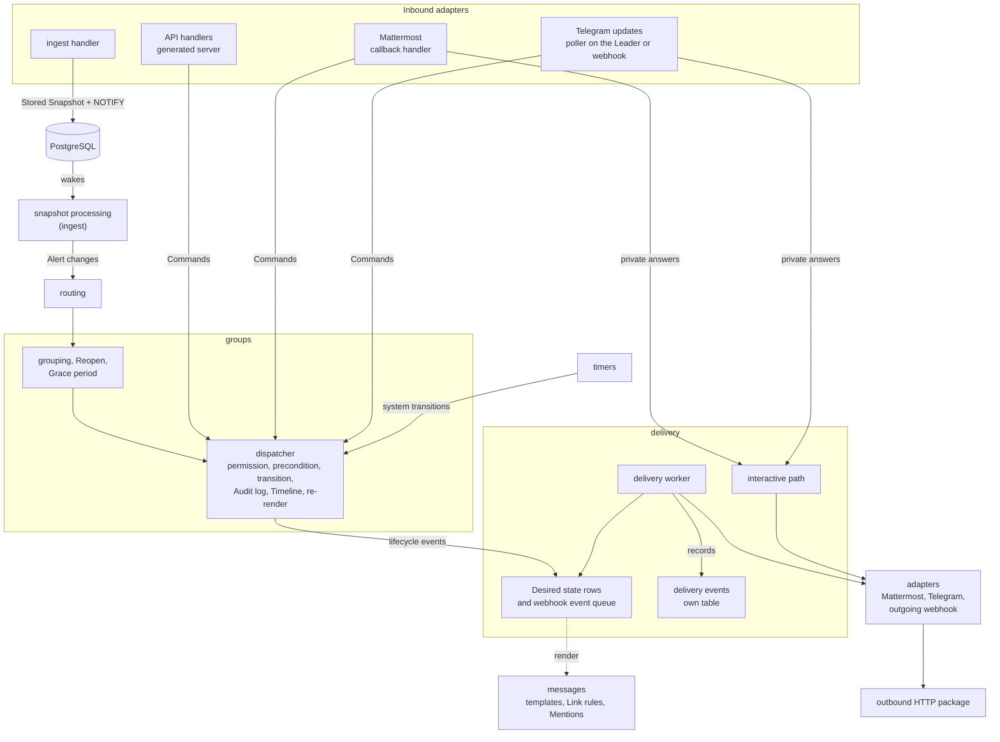
```mermaid
flowchart TB
    subgraph inbound["Inbound adapters"]
        ingestH["ingest handler"]
        apiH["API handlers<br/>generated server"]
        mmCb["Mattermost<br/>callback handler"]
        tgUp["Telegram updates<br/>poller on the Leader or webhook"]
    end

    processing["snapshot processing<br/>(ingest)"]
    routing["routing"]

    subgraph groups["groups"]
        grouping["grouping, Reopen,<br/>Grace period"]
        dispatcher["dispatcher<br/>permission, precondition, transition,<br/>Audit log, Timeline, re-render"]
    end

    timers["timers"]
    messages["messages<br/>templates, Link rules, Mentions"]

    subgraph delivery["delivery"]
        desired["Desired state rows<br/>and webhook event queue"]
        worker["delivery worker"]
        devents["delivery events<br/>own table"]
        interactive["interactive path"]
    end

    adapters["adapters<br/>Mattermost, Telegram,<br/>outgoing webhook"]
    outbound["outbound HTTP package"]
    db[("PostgreSQL")]

    ingestH -- "Stored Snapshot + NOTIFY" --> db
    db -- "wakes" --> processing
    processing -- "Alert changes" --> routing --> grouping --> dispatcher
    apiH -- "Commands" --> dispatcher
    mmCb -- "Commands" --> dispatcher
    tgUp -- "Commands" --> dispatcher
    timers -- "system transitions" --> dispatcher
    dispatcher -- "lifecycle events" --> desired
    desired -. "render" .-> messages
    worker --> desired
    worker -- "records" --> devents
    worker --> adapters
    mmCb & tgUp -- "private answers" --> interactive
    interactive --> adapters
    adapters --> outbound
```

- **Snapshot processing** reads Stored Snapshots in arrival order per Integration, splits them into Alerts by
  fingerprint, adds Static labels, applies the Snapshot semantics — duplicate window, Gone, truncation, staleness
  bookkeeping, learned repeat intervals, Continuations — and emits Alert changes ([ADR-0002], [C-06]). Internal alerts
  enter here as Alerts of the built-in "Muster" Integration ([C-06].FR-14).
- **Routing** picks the first matching Route, the Severity level and urgency ([ADR-0003], [C-08]); only newly firing
  Alerts are routed, because an Alert already in an open Alert Group stays there.
- **groups** joins an Alert to the open Alert Group with the same Group key values, reopens a system-resolved one with
  the same Route and Group key values inside its Reopen window — whichever Alert brings the key back — or creates a new
  one, and owns the **dispatcher** through which every Command and every system transition passes ([ADR-0004],
  [ADR-0016], [C-09], [C-10]). Only `groups` writes the Alert Group tables (architecture lint 2).
- **timers** claims timer rows with deadlines on any replica and turns them into system transitions — ack timeout
  notices, Unclaimed, Reminders, auto-unacknowledge, Snooze ends, Reopen window and Grace period ends ([C-09].FR-12,
  [C-17]).
- **messages** renders the Desired state — the default message or a Route's templates in the template sandbox, the
  Fallback template, Link rules with Lookup tables, Mentions — and signs buttons with the Keyring ([ADR-0012], [C-12]).
- **delivery** keeps one Desired state per Alert Group × Destination and the ordered event queue of outgoing webhooks in
  events mode; its **delivery worker** reconciles, and its **interactive path** answers people ([ADR-0005], [C-11]).
  Delivery events (Publication, possible duplicate, Not delivered and so on) go to a delivery-events table of delivery's
  own, never to the Alert Group tables; the Timeline view merges them with the Timeline entries by time as the kind
  `delivery`. They are not lifecycle events, so they reach neither delivery nor outgoing webhooks ([C-09].FR-22,
  [C-11].FR-21).
- **adapters** escape alert data for the messenger's markup, map responses to error classes and run Destination checks
  ([C-13], [C-14], [C-15]). The Telegram adapter also keeps the buffer that links a channel post to its automatic copy
  in the discussion group ([flow e](#e-telegram-thread-mapping)).

### 3.2 Access, configuration and secrets

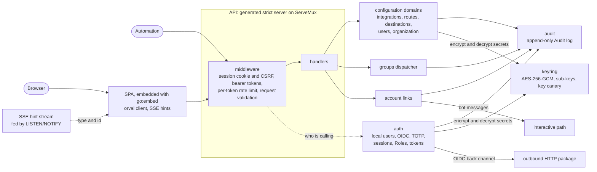
```mermaid
flowchart LR
    browser(["Browser"])
    automation(["Automation"])
    spa["SPA, embedded with go:embed<br/>orval client, SSE hints"]
    hints["SSE hint stream<br/>fed by LISTEN/NOTIFY"]

    subgraph api["API: generated strict server on ServeMux"]
        mw["middleware<br/>session cookie and CSRF, bearer tokens,<br/>per-token rate limit, request validation"]
        handlers["handlers"]
    end

    auth["auth<br/>local users, OIDC, TOTP,<br/>sessions, Roles, tokens"]
    crud["configuration domains<br/>integrations, routes, destinations,<br/>users, organization"]
    links["account links"]
    dispatcher["groups dispatcher"]
    audit["audit<br/>append-only Audit log"]
    keyring["keyring<br/>AES-256-GCM, sub-keys, key canary"]
    interactive["interactive path"]
    outbound["outbound HTTP package"]

    browser --> spa --> mw
    hints -. "type and id" .-> spa
    automation --> mw
    mw --> handlers
    mw -. "who is calling" .-> auth
    handlers --> crud
    handlers --> dispatcher
    handlers --> links
    crud & auth & links & dispatcher --> audit
    crud & auth -- "encrypt and decrypt secrets" --> keyring
    links -- "bot messages" --> interactive
    auth -- "OIDC back channel" --> outbound
```

- **API** is generated from `api/openapi.yaml` with oapi-codegen as a strict server on the standard `ServeMux`; requests
  are validated against the spec, errors are RFC 9457 `Problem` documents, configuration uses `ETag` and `If-Match`
  ([ADR-0008]). The SPA is built from the same spec with orval and gets live updates as server-sent hints `{type, id}`
  fed by `LISTEN/NOTIFY` ([ADR-0009]).
- **auth** covers local users with argon2id, OIDC with group-to-Role mapping, TOTP, sessions in PostgreSQL, three Roles
  checked by Permission, Personal access tokens and Service accounts; tokens Muster issues are stored as hashes ([C-03],
  [C-04], [ADR-0011]). An account signs in with a password or through OIDC, never both; OIDC users are re-checked at the
  IdP in the background every `auth.oidc_recheck_interval` with the offline token they granted, kept on the user as a
  Secret.
- **audit** records configuration changes with a before/after diff, security events and every command of people and
  automation, and copies each entry to the log ([C-03].FR-14).
- **keyring** holds the master keys from `MUSTER_SECRET_KEYS`, derives a sub-key per purpose (encryption, button
  signatures), encrypts every secret field, checks the key canary at startup and records which keys the replica holds
  ([ADR-0011], [C-20]).
- **account links** starts every link in the signed-in web session ([ADR-0013], [C-18]).

### 3.3 Platform

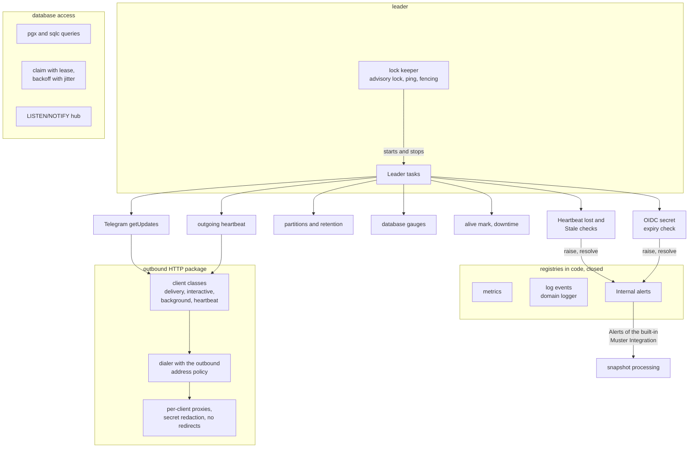
```mermaid
flowchart TB
    subgraph leader["leader"]
        lock["lock keeper<br/>advisory lock, ping, fencing"]
        tasks["Leader tasks"]
    end
    lock -- "starts and stops" --> tasks
    tasks --> tgpoll["Telegram getUpdates"]
    tasks --> checks["Heartbeat lost and<br/>Stale checks"]
    tasks --> parts["partitions and retention"]
    tasks --> gauges["database gauges"]
    tasks --> alive["alive mark, downtime"]
    tasks --> ohb["outgoing heartbeat"]
    tasks --> oidc["OIDC secret<br/>expiry check"]

    subgraph registries["registries in code, closed"]
        metrics["metrics"]
        logs["log events<br/>domain logger"]
        ialerts["Internal alerts"]
    end

    subgraph outbound["outbound HTTP package"]
        classes["client classes<br/>delivery, interactive,<br/>background, heartbeat"]
        dialer["dialer with the outbound<br/>address policy"]
        proxies["per-client proxies,<br/>secret redaction, no redirects"]
    end

    subgraph dbpkg["database access"]
        sqlc["pgx and sqlc queries"]
        claim["claim with lease,<br/>backoff with jitter"]
        notify["LISTEN/NOTIFY hub"]
    end

    checks & oidc -- "raise, resolve" --> ialerts
    ialerts -- "Alerts of the built-in<br/>Muster Integration" --> processing["snapshot processing"]
    tgpoll & ohb --> classes
    classes --> dialer --> proxies
```

- **leader** holds a session advisory lock with a bounded lease and runs only the Leader tasks; every task is safe to
  run twice, because a frozen old Leader can overlap with its successor for a moment ([ADR-0007],
  [flow h](#h-leader-election-and-timers)).
- **registries** are closed lists in code with generated reference pages: metrics with entity labels by immutable id and
  `le` histograms only, log events that the domain logger accepts, and Internal alerts with one name per condition
  shared with the chart rules ([ADR-0014]). `MusterSnapshotTruncated` is raised by processing, `MusterHeartbeatLost` and
  `MusterOIDCSecretExpiring` by the Leader, `MusterDestinationBroken` by delivery and `MusterTemplateError` by
  rendering ([reference](prd/l1/reference.md#internal-alerts)).
- **outbound HTTP package** is the only place that creates HTTP clients: it checks every resolved address against the
  outbound address policy inside the dialer, never follows redirects, applies the retry policy of the client class,
  uses the client's own proxy and redacts secrets that travel in URLs ([ADR-0015], [C-02].FR-20–22).
- **database access** uses `pgx` with `sqlc`; the three thin queue mechanisms — ingestion, delivery and timers — share
  claiming in a short transaction with a lease, backoff with jitter and slow calls outside the transaction; business
  queries take the current time from Go, never from `now()` ([ADR-0006]).

**Architecture lints** keep these boundaries ([ADR-0016]): every query on a table with `org_id` filters by it; only
`groups` writes Alert Group tables, with no exception for delivery, whose delivery events have a table of their own;
only the delivery worker and the interactive path send or edit messenger messages; only the outbound package creates
HTTP clients; no secret reaches a log line; `context.Background()` only in `main`, wiring and tests; logging only
through the domain logger; `le` histograms only.

---

## 4. Key flows

### a. Alertmanager webhook to delivery

Receipt is store-first: the handler checks the token and the body size, stores the Stored Snapshot and answers `202`
after the commit, well within Alertmanager's 15-second peer timeout ([ADR-0002], [C-05].FR-3).

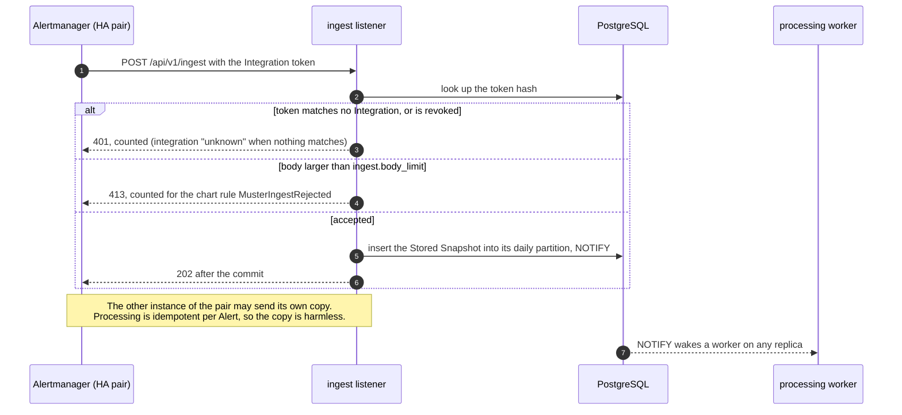
```mermaid
sequenceDiagram
    autonumber
    participant AM as Alertmanager (HA pair)
    participant IN as ingest listener
    participant DB as PostgreSQL
    participant PW as processing worker

    AM->>IN: POST /api/v1/ingest with the Integration token
    IN->>DB: look up the token hash
    alt token matches no Integration, or is revoked
        IN-->>AM: 401, counted (integration "unknown" when nothing matches)
    else body larger than ingest.body_limit
        IN-->>AM: 413, counted for the chart rule MusterIngestRejected
    else accepted
        IN->>DB: insert the Stored Snapshot into its daily partition, NOTIFY
        IN-->>AM: 202 after the commit
    end
    Note over AM,IN: The other instance of the pair may send its own copy.<br/>Processing is idempotent per Alert, so the copy is harmless.
    DB-->>PW: NOTIFY wakes a worker on any replica
```

Processing then turns the Snapshot into Alert changes and Alert Group transitions ([C-06], [C-08], [C-09]):

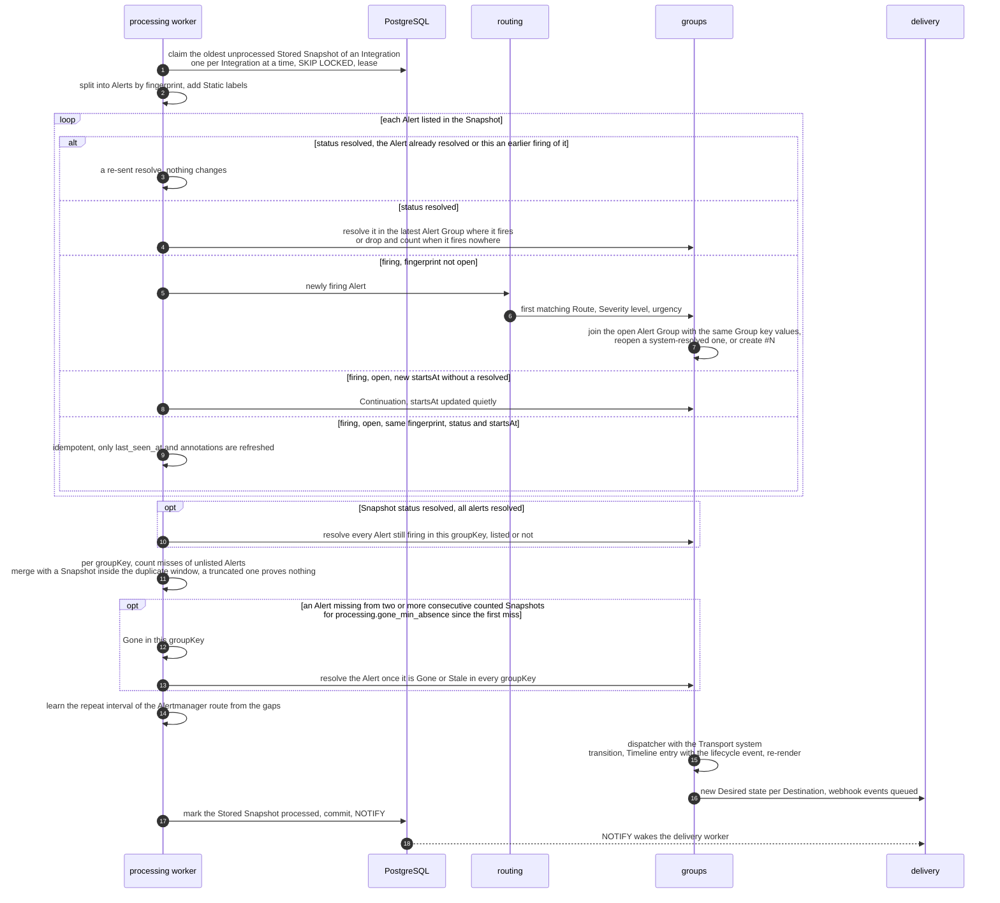
```mermaid
sequenceDiagram
    autonumber
    participant PW as processing worker
    participant DB as PostgreSQL
    participant RT as routing
    participant GR as groups
    participant DL as delivery

    PW->>DB: claim the oldest unprocessed Stored Snapshot of an Integration<br/>one per Integration at a time, SKIP LOCKED, lease
    PW->>PW: split into Alerts by fingerprint, add Static labels
    loop each Alert listed in the Snapshot
        alt status resolved, the Alert already resolved or this an earlier firing of it
            PW->>PW: a re-sent resolve, nothing changes
        else status resolved
            PW->>GR: resolve it in the latest Alert Group where it fires<br/>or drop and count when it fires nowhere
        else firing, fingerprint not open
            PW->>RT: newly firing Alert
            RT->>GR: first matching Route, Severity level, urgency
            GR->>GR: join the open Alert Group with the same Group key values,<br/>reopen a system-resolved one, or create #35;N
        else firing, open, new startsAt without a resolved
            PW->>GR: Continuation, startsAt updated quietly
        else firing, open, same fingerprint, status and startsAt
            PW->>PW: idempotent, only last_seen_at and annotations are refreshed
        end
    end
    opt Snapshot status resolved, all alerts resolved
        PW->>GR: resolve every Alert still firing in this groupKey, listed or not
    end
    PW->>PW: per groupKey, count misses of unlisted Alerts<br/>merge with a Snapshot inside the duplicate window, a truncated one proves nothing
    opt an Alert missing from two or more consecutive counted Snapshots<br/>for processing.gone_min_absence since the first miss
        PW->>PW: Gone in this groupKey
        PW->>GR: resolve the Alert once it is Gone or Stale in every groupKey
    end
    PW->>PW: learn the repeat interval of the Alertmanager route from the gaps
    GR->>GR: dispatcher with the Transport system<br/>transition, Timeline entry with the lifecycle event, re-render
    GR->>DL: new Desired state per Destination, webhook events queued
    PW->>DB: mark the Stored Snapshot processed, commit, NOTIFY
    DB-->>DL: NOTIFY wakes the delivery worker
```

Every lifecycle event carries its name, loudness and symbolic Mentions ([C-09].FR-22); it is the only input of delivery
([C-11].FR-20) and of outgoing webhook events ([C-15].FR-2). Processing writes one log line per Snapshot, never one per
Alert ([C-06].FR-15). The delivery side of the flow is [flow d](#d-delivery-reconciliation).

### b. Mattermost button press

Mattermost does not sign its callbacks, so each button carries an opaque action id signed with the button-signature
sub-key and its key id ([ADR-0011], [ADR-0013], [C-13].FR-4).

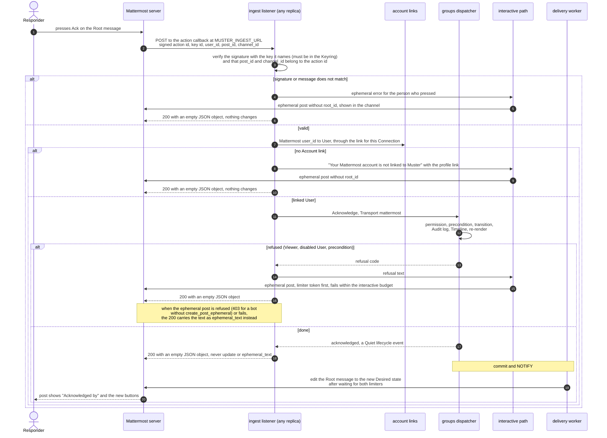
```mermaid
sequenceDiagram
    autonumber
    actor U as Responder
    participant MM as Mattermost server
    participant IN as ingest listener (any replica)
    participant AL as account links
    participant GR as groups dispatcher
    participant IP as interactive path
    participant DW as delivery worker

    U->>MM: presses Ack on the Root message
    MM->>IN: POST to the action callback at MUSTER_INGEST_URL<br/>signed action id, key id, user_id, post_id, channel_id
    IN->>IN: verify the signature with the key it names (must be in the Keyring)<br/>and that post_id and channel_id belong to the action id
    alt signature or message does not match
        IN->>IP: ephemeral error for the person who pressed
        IP->>MM: ephemeral post without root_id, shown in the channel
        IN-->>MM: 200 with an empty JSON object, nothing changes
    else valid
        IN->>AL: Mattermost user_id to User, through the link for this Connection
        alt no Account link
            IN->>IP: "Your Mattermost account is not linked to Muster" with the profile link
            IP->>MM: ephemeral post without root_id
            IN-->>MM: 200 with an empty JSON object, nothing changes
        else linked User
            IN->>GR: Acknowledge, Transport mattermost
            GR->>GR: permission, precondition, transition,<br/>Audit log, Timeline, re-render
            alt refused (Viewer, disabled User, precondition)
                GR-->>IN: refusal code
                IN->>IP: refusal text
                IP->>MM: ephemeral post, limiter token first, fails within the interactive budget
                IN-->>MM: 200 with an empty JSON object
                Note over IN,MM: when the ephemeral post is refused (403 for a bot<br/>without create_post_ephemeral) or fails,<br/>the 200 carries the text as ephemeral_text instead
            else done
                GR-->>IN: acknowledged, a Quiet lifecycle event
                IN-->>MM: 200 with an empty JSON object, never update or ephemeral_text
                Note over GR,DW: commit and NOTIFY
                DW->>MM: edit the Root message to the new Desired state<br/>after waiting for both limiters
                MM-->>U: post shows "Acknowledged by" and the new buttons
            end
        end
    end
```

Commands on one Alert Group are serialized, so two simultaneous presses give one acknowledgement and one Takeover
([C-10].FR-10). The answer to a press never edits the post: only the delivery worker edits the Root message. Text for
the person goes first as a separate ephemeral post through the interactive path — without `root_id` for a press on a
Root message, so that it shows in the channel view, in the Thread for a press on a Thread reply. That post needs the
`create_post_ephemeral` permission, which a bot with the role Member lacks; when it is refused, or fails in any other
way, the callback's answer carries the text as `ephemeral_text`, which Mattermost shows only inside the Root message's
Thread but which needs no permission, so the person always reads it ([C-13].FR-4,
[verified facts](facts.md#button-presses-and-answers)). The Connection check warns when the bot lacks the permission. Mattermost
reaches `MUSTER_INGEST_URL` with its untrusted HTTP client, so an internal address must be listed in its
`AllowedUntrustedInternalConnections`; otherwise a press shows only a generic "Action integration error" ([ADR-0013]).

### c. Telegram button press through long polling

In the default update mode the Leader polls the Bot API ([ADR-0007], [C-14].FR-1); in webhook mode Telegram posts the
same update to the ingest listener of any replica with the secret token header, and the rest is unchanged.

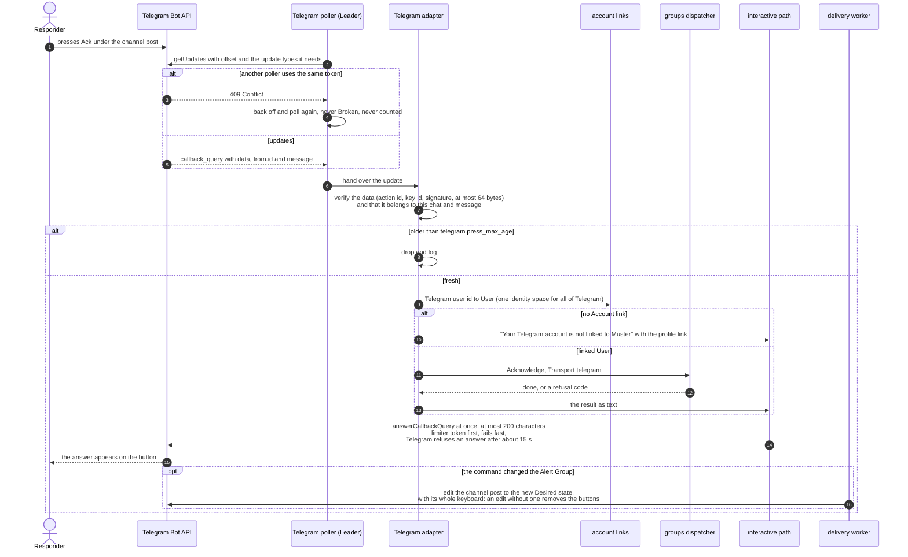
```mermaid
sequenceDiagram
    autonumber
    actor U as Responder
    participant TG as Telegram Bot API
    participant LP as Telegram poller (Leader)
    participant AD as Telegram adapter
    participant AL as account links
    participant GR as groups dispatcher
    participant IP as interactive path
    participant DW as delivery worker

    U->>TG: presses Ack under the channel post
    LP->>TG: getUpdates with offset and the update types it needs
    alt another poller uses the same token
        TG-->>LP: 409 Conflict
        LP->>LP: back off and poll again, never Broken, never counted
    else updates
        TG-->>LP: callback_query with data, from.id and message
    end
    LP->>AD: hand over the update
    AD->>AD: verify the data (action id, key id, signature, at most 64 bytes)<br/>and that it belongs to this chat and message
    alt older than telegram.press_max_age
        AD->>AD: drop and log
    else fresh
        AD->>AL: Telegram user id to User (one identity space for all of Telegram)
        alt no Account link
            AD->>IP: "Your Telegram account is not linked to Muster" with the profile link
        else linked User
            AD->>GR: Acknowledge, Transport telegram
            GR-->>AD: done, or a refusal code
            AD->>IP: the result as text
        end
        IP->>TG: answerCallbackQuery at once, at most 200 characters<br/>limiter token first, fails fast,<br/>Telegram refuses an answer after about 15 s
        TG-->>U: the answer appears on the button
        opt the command changed the Alert Group
            DW->>TG: edit the channel post to the new Desired state,<br/>with its whole keyboard: an edit without one removes the buttons
        end
    end
```

### d. Delivery reconciliation

The delivery worker brings the actual Root message to the latest Desired state with one call; changes made while a call
is pending collapse into the next one ([ADR-0005], [C-11].FR-1). The HTTP call is made outside any database transaction
through the delivery client class, which makes one attempt and leaves the next one to the row ([ADR-0015]). The limiters
are shared by all replicas: their token buckets live in PostgreSQL ([C-11].FR-3).

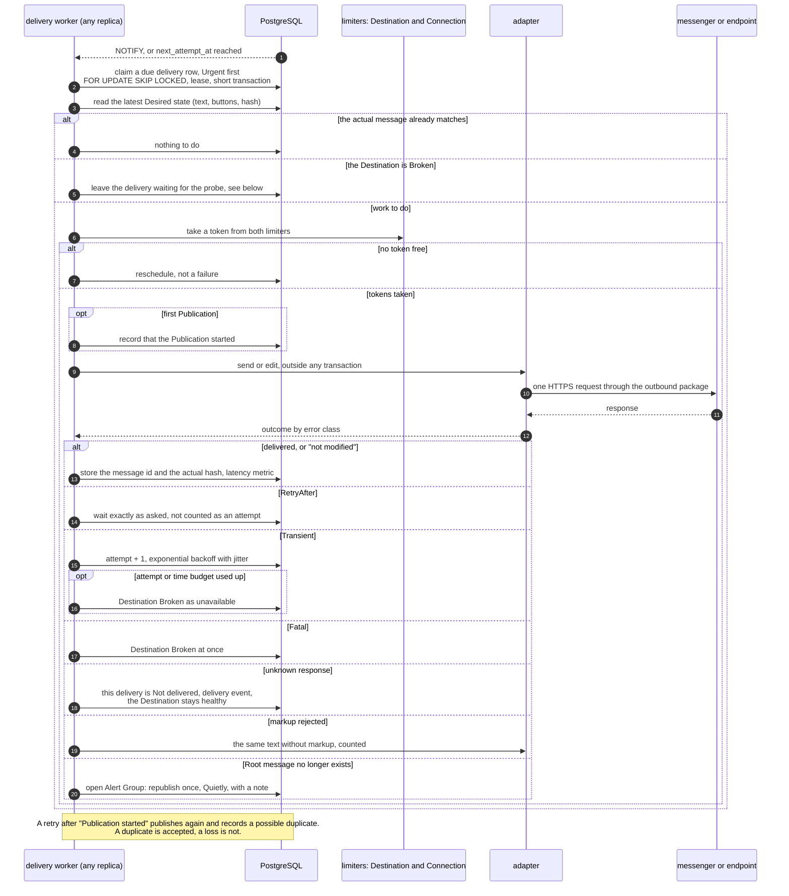
```mermaid
sequenceDiagram
    autonumber
    participant DW as delivery worker (any replica)
    participant DB as PostgreSQL
    participant LM as limiters: Destination and Connection
    participant AD as adapter
    participant MS as messenger or endpoint

    DB-->>DW: NOTIFY, or next_attempt_at reached
    DW->>DB: claim a due delivery row, Urgent first<br/>FOR UPDATE SKIP LOCKED, lease, short transaction
    DW->>DB: read the latest Desired state (text, buttons, hash)
    alt the actual message already matches
        DW->>DB: nothing to do
    else the Destination is Broken
        DW->>DB: leave the delivery waiting for the probe, see below
    else work to do
        DW->>LM: take a token from both limiters
        alt no token free
            DW->>DB: reschedule, not a failure
        else tokens taken
            opt first Publication
                DW->>DB: record that the Publication started
            end
            DW->>AD: send or edit, outside any transaction
            AD->>MS: one HTTPS request through the outbound package
            MS-->>AD: response
            AD-->>DW: outcome by error class
            alt delivered, or "not modified"
                DW->>DB: store the message id and the actual hash, latency metric
            else RetryAfter
                DW->>DB: wait exactly as asked, not counted as an attempt
            else Transient
                DW->>DB: attempt + 1, exponential backoff with jitter
                opt attempt or time budget used up
                    DW->>DB: Destination Broken as unavailable
                end
            else Fatal
                DW->>DB: Destination Broken at once
            else unknown response
                DW->>DB: this delivery is Not delivered, delivery event,<br/>the Destination stays healthy
            else markup rejected
                DW->>AD: the same text without markup, counted
            else Root message no longer exists
                DW->>DB: open Alert Group: republish once, Quietly, with a note
            end
        end
    end
    Note over DW,DB: A retry after "Publication started" publishes again and records a possible duplicate.<br/>A duplicate is accepted, a loss is not.
```

A Destination becomes Broken after a `Fatal` error or an exhausted `Transient` budget; nothing is dropped while it
waits, and recovery sends only the current state ([ADR-0005], [C-11].FR-9, FR-19). Nobody waits for the probe, so it
runs on any replica in the delivery client class, never on the interactive path ([ADR-0015]):

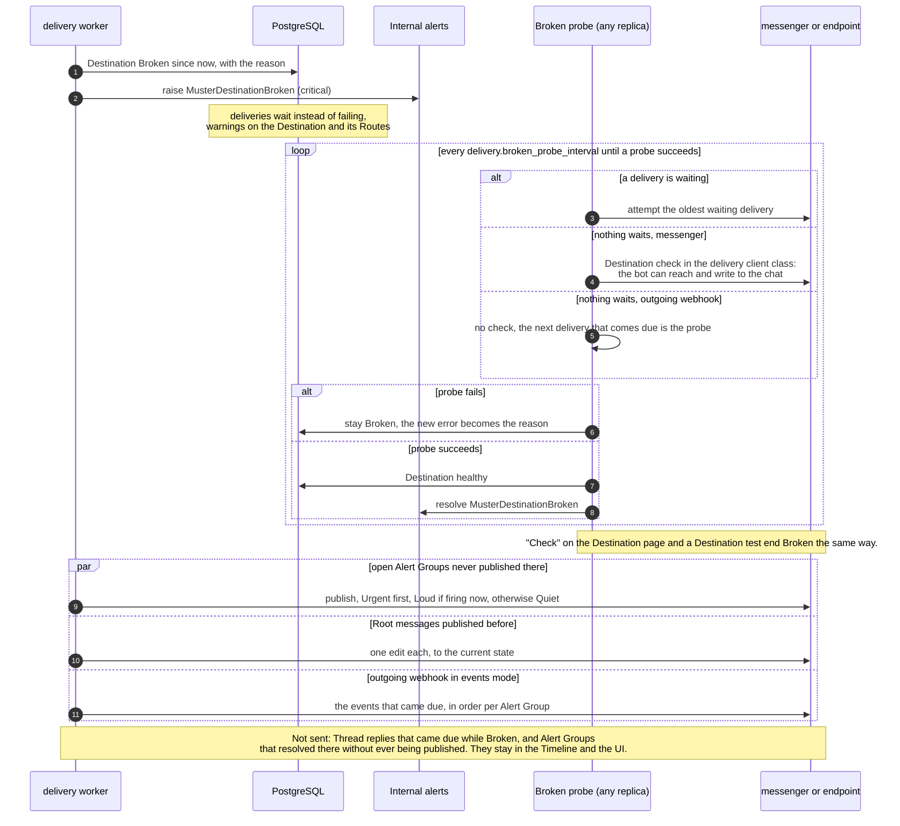
```mermaid
sequenceDiagram
    autonumber
    participant DW as delivery worker
    participant DB as PostgreSQL
    participant IA as Internal alerts
    participant PR as Broken probe (any replica)
    participant MS as messenger or endpoint

    DW->>DB: Destination Broken since now, with the reason
    DW->>IA: raise MusterDestinationBroken (critical)
    Note over DB: deliveries wait instead of failing,<br/>warnings on the Destination and its Routes
    loop every delivery.broken_probe_interval until a probe succeeds
        alt a delivery is waiting
            PR->>MS: attempt the oldest waiting delivery
        else nothing waits, messenger
            PR->>MS: Destination check in the delivery client class:<br/>the bot can reach and write to the chat
        else nothing waits, outgoing webhook
            PR->>PR: no check, the next delivery that comes due is the probe
        end
        alt probe fails
            PR->>DB: stay Broken, the new error becomes the reason
        else probe succeeds
            PR->>DB: Destination healthy
            PR->>IA: resolve MusterDestinationBroken
        end
    end
    Note over PR,MS: "Check" on the Destination page and a Destination test end Broken the same way.
    par open Alert Groups never published there
        DW->>MS: publish, Urgent first, Loud if firing now, otherwise Quiet
    and Root messages published before
        DW->>MS: one edit each, to the current state
    and outgoing webhook in events mode
        DW->>MS: the events that came due, in order per Alert Group
    end
    Note over DW,MS: Not sent: Thread replies that came due while Broken, and Alert Groups<br/>that resolved there without ever being published. They stay in the Timeline and the UI.
```

Two more rules complete the picture: an Alert Group that resolved while its first Publication waited for a `RetryAfter`
or for `Transient` retries within the budget is still published, Quietly, with a "delivered late" note — except during a
Storm or once the Destination is Broken ([C-11].FR-11); and during a Storm on a Route, each of its Destinations
receives one Storm summary instead of the non-urgent Alert Groups, while the events mode of outgoing webhooks receives
every event ([C-11].FR-6, [C-15].FR-2).

### e. Telegram Thread mapping

A Telegram Root message is a channel post; its Thread is the comment thread in the linked discussion group, which hangs
under Telegram's automatic copy of the post ([ADR-0005], [C-14].FR-3). A Telegram Destination names only the channel:
enabling comments on a channel in Telegram creates and links its discussion group, and Muster finds that group itself
from `getChat` on the channel (`linked_chat_id`) ([C-14].FR-2). The copy arrives as an update — on the Leader's
poller or at the webhook — and may come before or after the response to the send call, which may have been made on
another replica; the buffer that links the two therefore lives in the database. A bot that is an admin of the
discussion group receives the copy a few seconds after the post ([verified facts](facts.md#comment-threads)); Muster
recognizes it by `is_automatic_forward` and `forward_origin`, and never takes a copy for an edit. The channel carries
only Root messages; everything else about an Alert Group goes to its Thread, and only members of the discussion group
receive Thread replies ([C-14].FR-2, [C-14].FR-9). A copy deleted later loses the Thread ([C-14].FR-3).

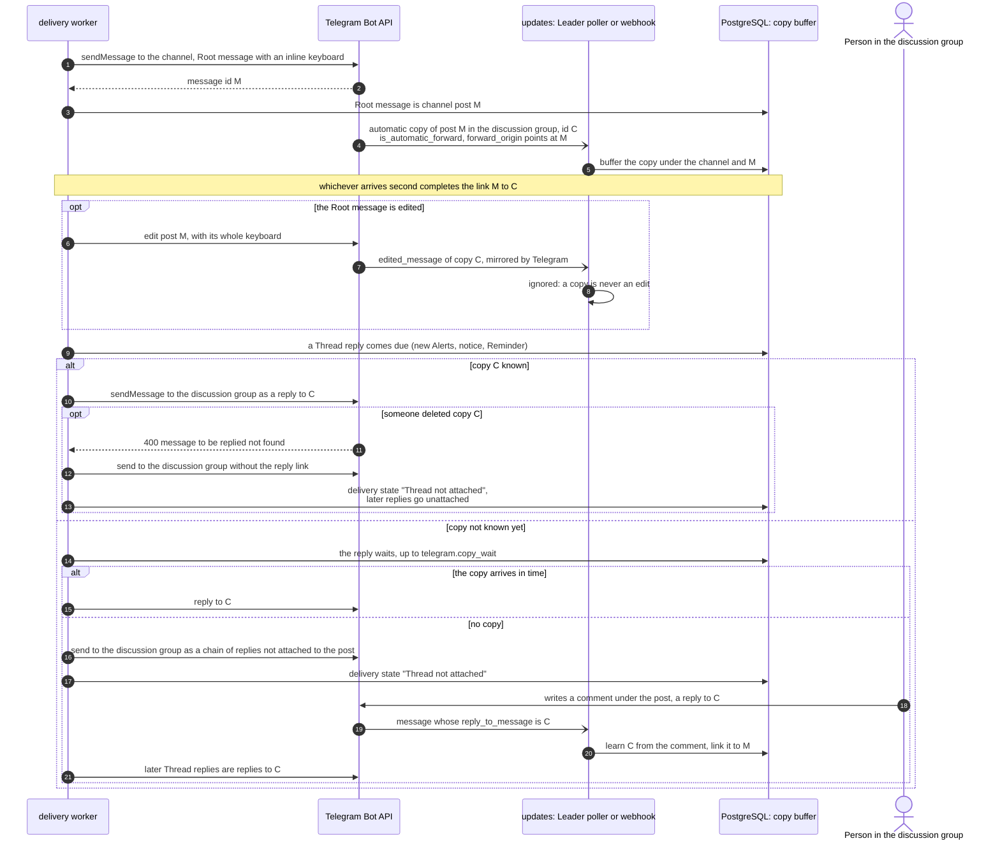
```mermaid
sequenceDiagram
    autonumber
    participant DW as delivery worker
    participant TG as Telegram Bot API
    participant UP as updates: Leader poller or webhook
    participant DB as PostgreSQL: copy buffer
    actor P as Person in the discussion group

    DW->>TG: sendMessage to the channel, Root message with an inline keyboard
    TG-->>DW: message id M
    DW->>DB: Root message is channel post M
    TG-)UP: automatic copy of post M in the discussion group, id C<br/>is_automatic_forward, forward_origin points at M
    UP->>DB: buffer the copy under the channel and M
    Note over DW,DB: whichever arrives second completes the link M to C
    opt the Root message is edited
        DW->>TG: edit post M, with its whole keyboard
        TG-)UP: edited_message of copy C, mirrored by Telegram
        UP->>UP: ignored: a copy is never an edit
    end
    DW->>DB: a Thread reply comes due (new Alerts, notice, Reminder)
    alt copy C known
        DW->>TG: sendMessage to the discussion group as a reply to C
        opt someone deleted copy C
            TG-->>DW: 400 message to be replied not found
            DW->>TG: send to the discussion group without the reply link
            DW->>DB: delivery state "Thread not attached",<br/>later replies go unattached
        end
    else copy not known yet
        DW->>DB: the reply waits, up to telegram.copy_wait
        alt the copy arrives in time
            DW->>TG: reply to C
        else no copy
            DW->>TG: send to the discussion group as a chain of replies not attached to the post
            DW->>DB: delivery state "Thread not attached"
            P->>TG: writes a comment under the post, a reply to C
            TG-)UP: message whose reply_to_message is C
            UP->>DB: learn C from the comment, link it to M
            DW->>TG: later Thread replies are replies to C
        end
    end
```

### f. Account links

Every Account link starts in the user's signed-in web session, and the secret travels from that session to the
messenger account, never the other way ([ADR-0013], [C-18]). Bot messages during linking go through the interactive
path. The profile picks the Connection from its own short list — the id, the name and the messenger of each — which
needs no Permission.

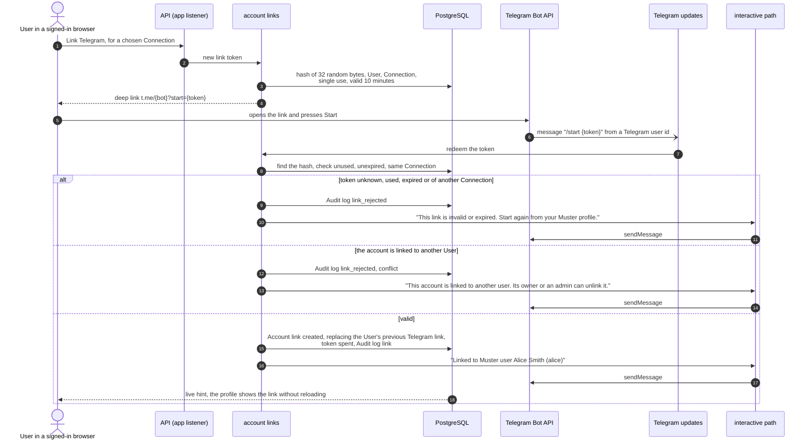
```mermaid
sequenceDiagram
    autonumber
    actor U as User in a signed-in browser
    participant API as API (app listener)
    participant AL as account links
    participant DB as PostgreSQL
    participant TG as Telegram Bot API
    participant UP as Telegram updates
    participant IP as interactive path

    U->>API: Link Telegram, for a chosen Connection
    API->>AL: new link token
    AL->>DB: hash of 32 random bytes, User, Connection,<br/>single use, valid 10 minutes
    AL-->>U: deep link t.me/{bot}?start={token}
    U->>TG: opens the link and presses Start
    TG-)UP: message "/start {token}" from a Telegram user id
    UP->>AL: redeem the token
    AL->>DB: find the hash, check unused, unexpired, same Connection
    alt token unknown, used, expired or of another Connection
        AL->>DB: Audit log link_rejected
        AL->>IP: "This link is invalid or expired. Start again from your Muster profile."
        IP->>TG: sendMessage
    else the account is linked to another User
        AL->>DB: Audit log link_rejected, conflict
        AL->>IP: "This account is linked to another user. Its owner or an admin can unlink it."
        IP->>TG: sendMessage
    else valid
        AL->>DB: Account link created, replacing the User's previous Telegram link,<br/>token spent, Audit log link
        AL->>IP: "Linked to Muster user Alice Smith (alice)"
        IP->>TG: sendMessage
        DB-->>U: live hint, the profile shows the link without reloading
    end
```

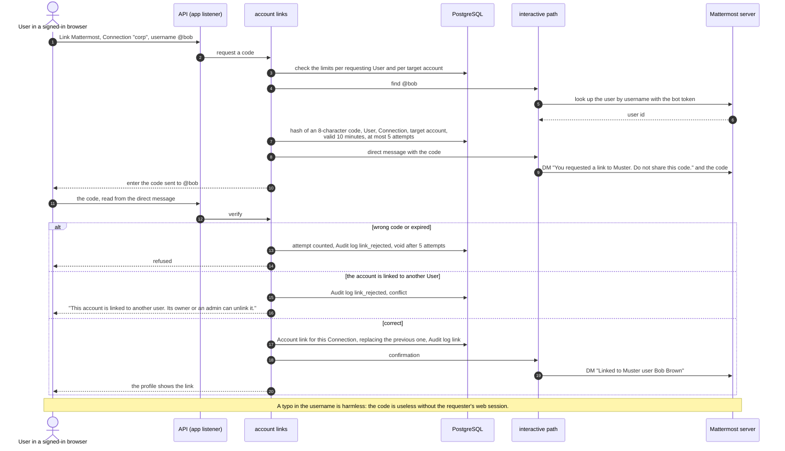
```mermaid
sequenceDiagram
    autonumber
    actor U as User in a signed-in browser
    participant API as API (app listener)
    participant AL as account links
    participant DB as PostgreSQL
    participant IP as interactive path
    participant MM as Mattermost server

    U->>API: Link Mattermost, Connection "corp", username @bob
    API->>AL: request a code
    AL->>DB: check the limits per requesting User and per target account
    AL->>IP: find @bob
    IP->>MM: look up the user by username with the bot token
    MM-->>IP: user id
    AL->>DB: hash of an 8-character code, User, Connection, target account,<br/>valid 10 minutes, at most 5 attempts
    AL->>IP: direct message with the code
    IP->>MM: DM "You requested a link to Muster. Do not share this code." and the code
    AL-->>U: enter the code sent to @bob
    U->>API: the code, read from the direct message
    API->>AL: verify
    alt wrong code or expired
        AL->>DB: attempt counted, Audit log link_rejected, void after 5 attempts
        AL-->>U: refused
    else the account is linked to another User
        AL->>DB: Audit log link_rejected, conflict
        AL-->>U: "This account is linked to another user. Its owner or an admin can unlink it."
    else correct
        AL->>DB: Account link for this Connection, replacing the previous one, Audit log link
        AL->>IP: confirmation
        IP->>MM: DM "Linked to Muster user Bob Brown"
        AL-->>U: the profile shows the link
    end
    Note over U,MM: A typo in the username is harmless: the code is useless without the requester's web session.
```

### g. Reopen within the Reopen window

After a system resolve, any Alert with the same Route and Group key values that fires within the Route's Reopen window —
one of the Alert Group's own Alerts or a new one — reopens the same Alert Group and restores the status it had before
([ADR-0004], [C-09].FR-4). After a manual resolve no Reopen window applies.

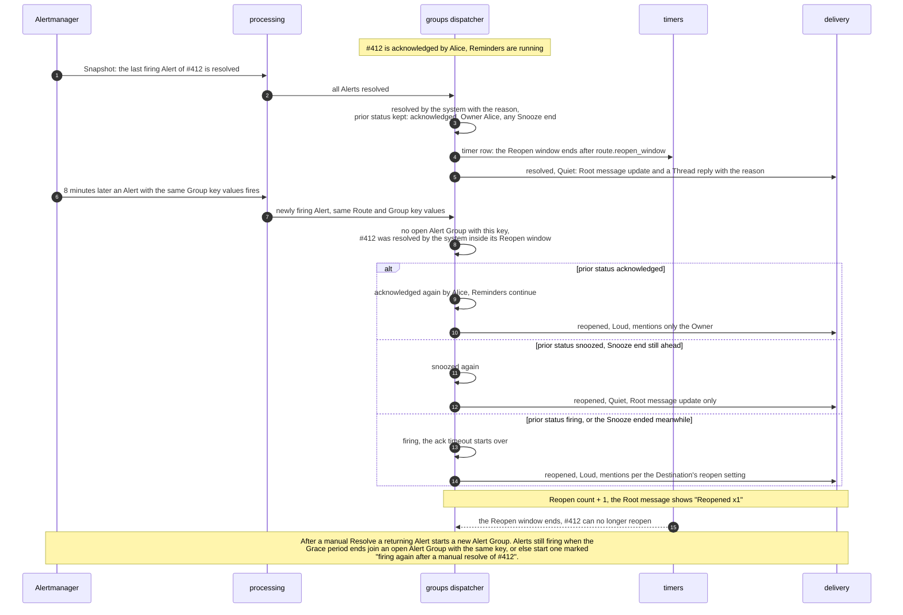
```mermaid
sequenceDiagram
    autonumber
    participant AM as Alertmanager
    participant PW as processing
    participant GR as groups dispatcher
    participant TM as timers
    participant DL as delivery

    Note over GR: #35;412 is acknowledged by Alice, Reminders are running
    AM->>PW: Snapshot: the last firing Alert of #35;412 is resolved
    PW->>GR: all Alerts resolved
    GR->>GR: resolved by the system with the reason,<br/>prior status kept: acknowledged, Owner Alice, any Snooze end
    GR->>TM: timer row: the Reopen window ends after route.reopen_window
    GR->>DL: resolved, Quiet: Root message update and a Thread reply with the reason
    AM->>PW: 8 minutes later an Alert with the same Group key values fires
    PW->>GR: newly firing Alert, same Route and Group key values
    GR->>GR: no open Alert Group with this key,<br/>#35;412 was resolved by the system inside its Reopen window
    alt prior status acknowledged
        GR->>GR: acknowledged again by Alice, Reminders continue
        GR->>DL: reopened, Loud, mentions only the Owner
    else prior status snoozed, Snooze end still ahead
        GR->>GR: snoozed again
        GR->>DL: reopened, Quiet, Root message update only
    else prior status firing, or the Snooze ended meanwhile
        GR->>GR: firing, the ack timeout starts over
        GR->>DL: reopened, Loud, mentions per the Destination's reopen setting
    end
    Note over GR,DL: Reopen count + 1, the Root message shows "Reopened x1"
    TM-->>GR: the Reopen window ends, #35;412 can no longer reopen
    Note over AM,DL: After a manual Resolve a returning Alert starts a new Alert Group. Alerts still firing when the<br/>Grace period ends join an open Alert Group with the same key, or else start one marked<br/>"firing again after a manual resolve of #35;412".
```

### h. Leader election and timers

Every replica serves traffic and claims delivery and timer rows; the Leader holds a session advisory lock with a bounded
lease and runs only the singleton tasks ([ADR-0007], [C-02].FR-10). Defaults: `leader.ping_interval` 5 s,
`leader.fencing_timeout` 15 s, `leader.server_bound` 30 s.

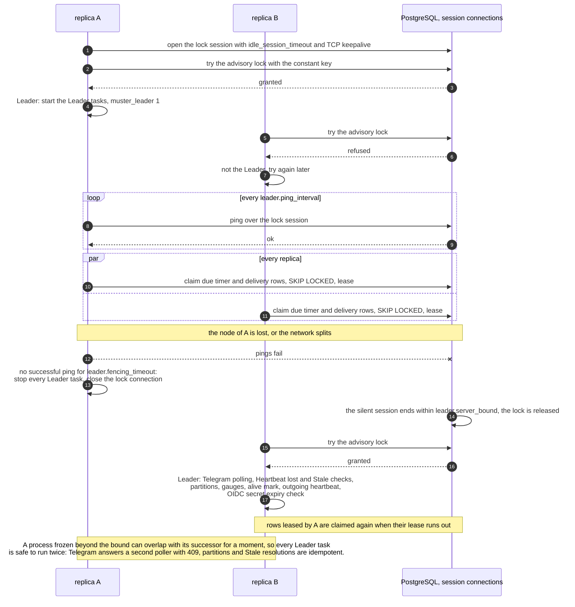
```mermaid
sequenceDiagram
    autonumber
    participant A as replica A
    participant B as replica B
    participant PG as PostgreSQL, session connections

    A->>PG: open the lock session with idle_session_timeout and TCP keepalive
    A->>PG: try the advisory lock with the constant key
    PG-->>A: granted
    A->>A: Leader: start the Leader tasks, muster_leader 1
    B->>PG: try the advisory lock
    PG-->>B: refused
    B->>B: not the Leader, try again later
    loop every leader.ping_interval
        A->>PG: ping over the lock session
        PG-->>A: ok
    end
    par every replica
        A->>PG: claim due timer and delivery rows, SKIP LOCKED, lease
    and
        B->>PG: claim due timer and delivery rows, SKIP LOCKED, lease
    end
    Note over A,PG: the node of A is lost, or the network splits
    A--xPG: pings fail
    A->>A: no successful ping for leader.fencing_timeout:<br/>stop every Leader task, close the lock connection
    PG->>PG: the silent session ends within leader.server_bound, the lock is released
    B->>PG: try the advisory lock
    PG-->>B: granted
    B->>B: Leader: Telegram polling, Heartbeat lost and Stale checks,<br/>partitions, gauges, alive mark, outgoing heartbeat,<br/>OIDC secret expiry check
    Note over B,PG: rows leased by A are claimed again when their lease runs out
    Note over A,B: A process frozen beyond the bound can overlap with its successor for a moment, so every Leader task<br/>is safe to run twice: Telegram answers a second poller with 409, partitions and Stale resolutions are idempotent.
```

The Leader writes an "alive" mark every 30 seconds; after a full outage the next Leader records the period, opens the
recovery notice and adds a Timeline entry to every open Alert Group, while overdue timer rows fire once, collapsed
([C-02].FR-12, [C-09].FR-18, [C-17].FR-7). `MusterNoLeader` fires when no replica has led for 2 minutes; ingestion,
delivery and timers keep working meanwhile ([ADR-0014]).

### i. Staleness with Heartbeat liveness

An Alert whose Alertmanager group stops arriving — for example because the whole group is silenced in Alertmanager —
goes Stale after `stale_after`, but only time with a live Heartbeat counts ([ADR-0002], [C-06].FR-9, [C-07]). The
numbers follow [C-07].AC-4: a learned repeat interval of 5 minutes, so `stale_after` is 15 minutes of counted time.

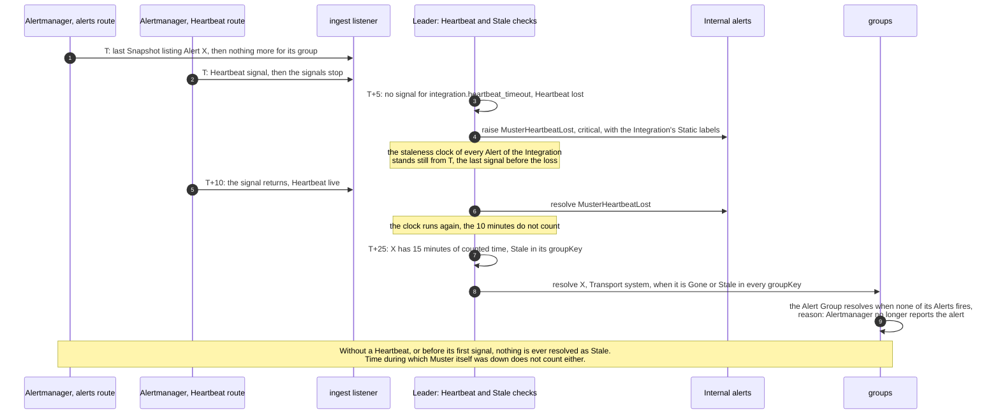
```mermaid
sequenceDiagram
    autonumber
    participant AMA as Alertmanager, alerts route
    participant AMH as Alertmanager, Heartbeat route
    participant IN as ingest listener
    participant LD as Leader: Heartbeat and Stale checks
    participant IA as Internal alerts
    participant GR as groups

    AMA->>IN: T: last Snapshot listing Alert X, then nothing more for its group
    AMH->>IN: T: Heartbeat signal, then the signals stop
    LD->>LD: T+5: no signal for integration.heartbeat_timeout, Heartbeat lost
    LD->>IA: raise MusterHeartbeatLost, critical, with the Integration's Static labels
    Note over LD: the staleness clock of every Alert of the Integration<br/>stands still from T, the last signal before the loss
    AMH->>IN: T+10: the signal returns, Heartbeat live
    LD->>IA: resolve MusterHeartbeatLost
    Note over LD: the clock runs again, the 10 minutes do not count
    LD->>LD: T+25: X has 15 minutes of counted time, Stale in its groupKey
    LD->>GR: resolve X, Transport system, when it is Gone or Stale in every groupKey
    GR->>GR: the Alert Group resolves when none of its Alerts fires,<br/>reason: Alertmanager no longer reports the alert
    Note over AMA,GR: Without a Heartbeat, or before its first signal, nothing is ever resolved as Stale.<br/>Time during which Muster itself was down does not count either.
```

Until a repeat interval is learned for an Alertmanager route, `stale_after` is 25 hours. While a `groupKey` is
truncated, its unlisted Alerts stay alive as long as Snapshots of that group keep arriving ([C-06].FR-6, FR-8).

### j. Master key rotation

New keys always arrive through the environment; activation succeeds only when every live replica holds the key
([ADR-0011], [C-20].FR-6, FR-7).

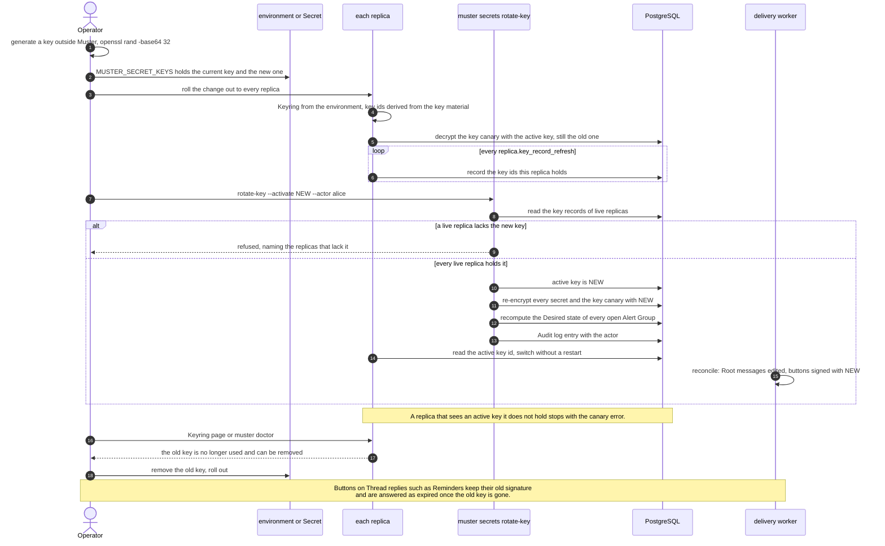
```mermaid
sequenceDiagram
    autonumber
    actor OP as Operator
    participant ENV as environment or Secret
    participant R as each replica
    participant CLI as muster secrets rotate-key
    participant DB as PostgreSQL
    participant DW as delivery worker

    OP->>OP: generate a key outside Muster, openssl rand -base64 32
    OP->>ENV: MUSTER_SECRET_KEYS holds the current key and the new one
    OP->>R: roll the change out to every replica
    R->>R: Keyring from the environment, key ids derived from the key material
    R->>DB: decrypt the key canary with the active key, still the old one
    loop every replica.key_record_refresh
        R->>DB: record the key ids this replica holds
    end
    OP->>CLI: rotate-key --activate NEW --actor alice
    CLI->>DB: read the key records of live replicas
    alt a live replica lacks the new key
        CLI-->>OP: refused, naming the replicas that lack it
    else every live replica holds it
        CLI->>DB: active key is NEW
        CLI->>DB: re-encrypt every secret and the key canary with NEW
        CLI->>DB: recompute the Desired state of every open Alert Group
        CLI->>DB: Audit log entry with the actor
        R->>DB: read the active key id, switch without a restart
        DW->>DW: reconcile: Root messages edited, buttons signed with NEW
    end
    Note over R,DB: A replica that sees an active key it does not hold stops with the canary error.
    OP->>R: Keyring page or muster doctor
    R-->>OP: the old key is no longer used and can be removed
    OP->>ENV: remove the old key, roll out
    Note over OP,DW: Buttons on Thread replies such as Reminders keep their old signature<br/>and are answered as expired once the old key is gone.
```

---

## 5. State machines

### 5.1 Alert Group

Four statuses and nothing more; Reopen counts, the Unclaimed flag and similar facts are attributes ([ADR-0004],
[C-09], [C-10], [C-17]). Resolved is drawn twice because a system resolve and a person's resolve allow different ways
back. Labels marked _system_ are transitions Muster starts itself, through the same dispatcher with the Transport
`system`.

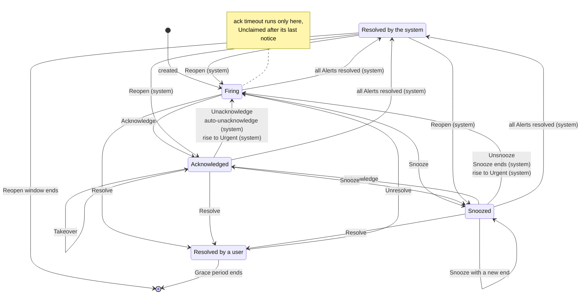
```mermaid
stateDiagram-v2
    state "Resolved by the system" as ResolvedBySystem
    state "Resolved by a user" as ResolvedByUser

    [*] --> Firing : created
    Firing --> Acknowledged : Acknowledge
    Snoozed --> Acknowledged : Acknowledge
    Acknowledged --> Acknowledged : Takeover
    Acknowledged --> Firing : Unacknowledge<br/>auto-unacknowledge (system)<br/>rise to Urgent (system)
    Firing --> Snoozed : Snooze
    Acknowledged --> Snoozed : Snooze
    Snoozed --> Snoozed : Snooze with a new end
    Snoozed --> Firing : Unsnooze<br/>Snooze ends (system)<br/>rise to Urgent (system)
    Firing --> ResolvedByUser : Resolve
    Acknowledged --> ResolvedByUser : Resolve
    Snoozed --> ResolvedByUser : Resolve
    Firing --> ResolvedBySystem : all Alerts resolved (system)
    Acknowledged --> ResolvedBySystem : all Alerts resolved (system)
    Snoozed --> ResolvedBySystem : all Alerts resolved (system)
    ResolvedBySystem --> Firing : Reopen (system)
    ResolvedBySystem --> Acknowledged : Reopen (system)
    ResolvedBySystem --> Snoozed : Reopen (system)
    ResolvedByUser --> Firing : Unresolve
    ResolvedBySystem --> [*] : Reopen window ends
    ResolvedByUser --> [*] : Grace period ends

    note left of Firing
        ack timeout runs only here,
        Unclaimed after its last notice
    end note
```

| Transition | Trigger | Transport | Lifecycle event, loudness, Mentions |
|---|---|---|---|
| start → Firing | a newly firing Alert with no open Alert Group of its Route and Group key values, and no Reopen; also Alerts still firing when the Grace period after a manual resolve ends | system | `created`, Loud, `new_alert_group` |
| Firing → Acknowledged | Acknowledge | `ui`, `api`, `mattermost`, `telegram` | `acknowledged`, Quiet |
| Snoozed → Acknowledged | Acknowledge, which ends the Snooze | people | `acknowledged`, Quiet |
| Acknowledged → Acknowledged | Acknowledge by another user: Takeover, Reminders start over; by the Owner: no change, no event | people | `takeover`, Loud, `previous_owner` |
| Acknowledged → Firing | Unacknowledge, by any user with the Permission | people | `unacknowledged`, Quiet |
| Acknowledged → Firing | auto-unacknowledge after two unanswered Reminders, where the Route turns it on | system | `auto_unacknowledged`, Loud, `owner` |
| Acknowledged → Firing | a rise in Severity level makes it Urgent and `route.urgent_rise_removes_ack` is on | system | `urgency_raised`, Loud, `owner` and `rise_to_urgent` |
| Firing or Acknowledged → Snoozed, Snoozed → Snoozed | Snooze until a time or with no end; messengers offer the Route's durations | people | `snoozed`, Quiet |
| Snoozed → Firing | Unsnooze | people | `unsnoozed`, Quiet |
| Snoozed → Firing | the Snooze runs out while Alerts fire; lists what accumulated | system | `snooze_ended`, Loud, `snooze_ended` |
| Snoozed → Firing | a rise to Urgent, unless the Snooze was set while already Urgent | system | `urgency_raised`, Loud |
| open → Resolved by a user | Resolve, with an optional Note | people | `resolved`, Quiet |
| open → Resolved by the system | the last Alert resolves: `resolved` from Alertmanager, Gone, Stale or Integration deleted; ends a Snooze | system | `resolved`, Quiet, with a Thread reply giving the reason |
| Resolved by the system → prior status | Reopen: any Alert with the same Route and Group key values fires within the Reopen window | system | `reopened`: Loud into firing (`reopen`) and into acknowledged (`owner` only), Quiet into snoozed |
| Resolved by a user → Firing | Unresolve, UI and API only; refused when no Alert still fires or a newer open Alert Group with the same key exists | `ui`, `api` | `unresolved`, Quiet |

`owner` names the Owner as it was before the transition, so in `urgency_raised` and `auto_unacknowledged` it is the
Owner who loses the Alert Group ([C-09].FR-22). The ack timeout starts at the first Publication and starts over on every
transition into Firing; Acknowledge, Snooze and Resolve stop it. Unclaimed ends when the Alert Group stops being firing
([C-17].FR-1, FR-3). New Alerts and configuration edits never change a status ([ADR-0003]).

### 5.2 Destination

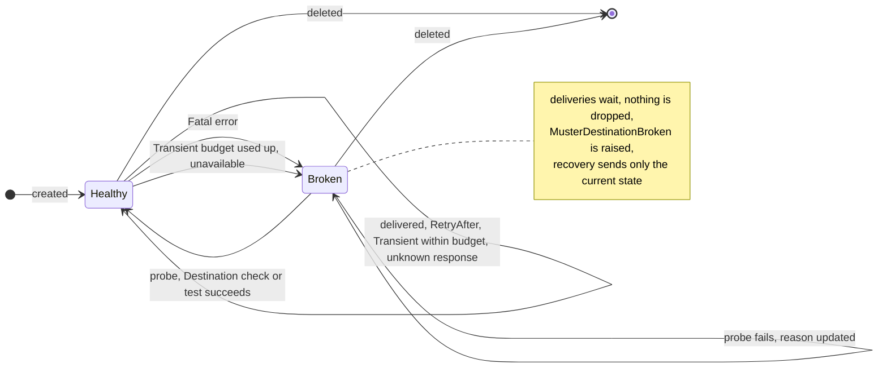
```mermaid
stateDiagram-v2
    direction LR
    [*] --> Healthy : created
    Healthy --> Healthy : delivered, RetryAfter, Transient within budget, unknown response
    Healthy --> Broken : Fatal error
    Healthy --> Broken : Transient budget used up, unavailable
    Broken --> Broken : probe fails, reason updated
    Broken --> Healthy : probe, Destination check or test succeeds
    Healthy --> [*] : deleted
    Broken --> [*] : deleted

    note right of Broken
        deliveries wait, nothing is dropped,
        MusterDestinationBroken is raised,
        recovery sends only the current state
    end note
```

An unknown response ends only that delivery as Not delivered and leaves the Destination healthy; a `RetryAfter` is not
an attempt ([ADR-0005], [C-11].FR-8–10). A Destination removed from a Route, or deleted, gets one final edit of each
open Root message ([C-11].FR-14).

### 5.3 Alert

An Alert is one fingerprint. Its own lifecycle is short; the interesting part is its presence in each Alertmanager group
(`groupKey`) that lists it ([ADR-0002], [C-06]).

```mermaid
stateDiagram-v2
    direction LR
    [*] --> Firing : firing, new fingerprint or after the Alert resolved
    Firing --> Firing : Continuation, new startsAt without a resolved
    Firing --> Firing : listed again, annotations changed
    Firing --> Resolved : resolved from Alertmanager, for the Alert or its whole groupKey
    Firing --> Resolved : Gone or Stale in every groupKey
    Firing --> Resolved : Integration deleted
    Resolved --> [*]
```

Presence of one Alert in one `groupKey`:

```mermaid
stateDiagram-v2
    direction LR
    [*] --> Listed
    Listed --> Missed : absent from a counted Snapshot, missed_since recorded
    Missed --> Listed : listed again, also by a near-duplicate in the duplicate window
    Missed --> Missed : absent again, sooner than processing.gone_min_absence after missed_since
    Missed --> Gone : absent again, processing.gone_min_absence or more after missed_since
    Listed --> Stale : not seen for stale_after with a live Heartbeat
    Missed --> Stale : not seen for stale_after with a live Heartbeat
    Gone --> Listed : listed again
    Stale --> Listed : listed again

    note right of Listed
        a truncated Snapshot never counts as absence,
        the staleness clock stands still without
        a live Heartbeat and while Muster was down
        longer than the Heartbeat timeout
    end note
```

A Continuation is Quiet and reopens nothing; once the Alert itself has resolved — explicitly, as Gone or as Stale — the
next firing of that fingerprint is a new firing, which reopens a system-resolved Alert Group inside its Reopen window or
starts a new one. A repeated `resolved` of an Alert that is already resolved changes nothing ([C-06].FR-4), and a
Snapshot with `status: resolved` resolves every Alert still firing in its `groupKey`, listed or not ([C-06].FR-21).
Internal alerts are raised and resolved only explicitly and are never Gone or Stale ([C-06].FR-14).

---

## 6. Conceptual data model

**Conceptual only.** The diagrams name the main entities and their relations so that the physical schema, the SQL
queries and the OpenAPI resources start from one picture; tables, keys, indexes and partitions are designed next. Every
table carries `org_id` and every query filters by it ([ADR-0006], [ADR-0016]); the diagrams draw the Organization only
where it owns top-level configuration. Retention: Stored Snapshots 14 days in daily partitions; Timeline entries and
delivery events 90 days in monthly partitions; Alerts inside Alert Groups 90 days after their firing ended, removed by
batched deletes, because an Alert Group lives as long as any of its Alerts fires and a dropped time partition would
take Alerts that still fire; Alert Group summary rows, with title, `summary` and their Notes, 2 years; the Audit log
1 year ([C-09].FR-16, [defaults](prd/l1/defaults.md#organization)).

### 6.1 Identity and access

```mermaid
erDiagram
    Organization ||--o{ User : has
    Organization ||--o{ ServiceAccount : has
    Role ||--o{ User : "given to"
    Role ||--o{ ServiceAccount : "given to"
    User ||--o{ Session : "signs in with"
    User ||--o{ PersonalAccessToken : owns
    ServiceAccount ||--o{ ServiceAccountToken : owns
    User ||--o{ AccountLink : has
    Connection |o--o{ AccountLink : "identity space (Mattermost)"
    User ||--o{ AccountLinkRequest : starts
    Connection ||--o{ AccountLinkRequest : "through the bot of"

    User {
        id id PK
        string login UK
        string display_name
        string source "local or OIDC"
        string status "active, disabled, deleted"
        bool totp_enrolled
    }
    Role {
        string name PK "Admin, Responder, Viewer"
        string permissions "fixed set in L1"
    }
    Session {
        id id PK
        timestamp last_seen_at
        timestamp expires_at
    }
    PersonalAccessToken {
        id id PK
        string name
        string hash "mstr_ prefix, shown once"
        string permissions "narrows the owner's"
        timestamp expires_at
    }
    ServiceAccountToken {
        id id PK
        string hash
        timestamp last_used_at
    }
    AccountLink {
        id id PK
        string messenger "telegram or mattermost"
        string external_id UK "per identity space"
        string username
        timestamp last_used_at
    }
    AccountLinkRequest {
        id id PK
        string kind "Telegram token or Mattermost code"
        string hash
        int attempts
        timestamp expires_at
    }
```

### 6.2 Ingestion and Alert Groups

```mermaid
erDiagram
    Organization ||--o{ Integration : has
    Integration ||--o{ IntegrationToken : accepts
    Integration ||--o{ StoredSnapshot : receives
    Integration ||--o{ AlertmanagerRoute : "learns from groupKey"
    AlertmanagerRoute ||--o{ AlertmanagerGroup : contains
    Integration ||--o{ Alert : reports
    Alert ||--|{ AlertPresence : "listed in"
    AlertmanagerGroup ||--o{ AlertPresence : lists
    Route ||--o{ AlertGroup : "groups into"
    AlertGroup |o--o{ Alert : contains
    AlertGroup ||--o{ TimelineEntry : records
    AlertGroup ||--o{ Note : has
    User |o--o{ AlertGroup : owns
    User |o--o{ Note : writes

    Integration {
        id id PK
        string name UK
        string connection_mode "webhook-only in L1"
        jsonb static_labels
        interval duplicate_window
        string heartbeat_state "not configured, waiting, live, lost"
        bool builtin "the Muster Integration"
    }
    IntegrationToken {
        id id PK
        string hash "shown once"
        timestamp revoked_at
    }
    StoredSnapshot {
        id id PK
        timestamp received_at "daily partition"
        jsonb body "kept as received"
        timestamp processed_at
    }
    AlertmanagerRoute {
        string route_path PK "taken from groupKey"
        interval learned_repeat_interval
    }
    AlertmanagerGroup {
        string group_key PK
        bool truncated
        timestamp last_snapshot_at
    }
    Alert {
        id id PK
        string fingerprint
        jsonb labels
        jsonb annotations
        timestamp starts_at
        string state "firing or resolved"
        string resolve_reason "resolved, gone, stale, integration_deleted"
    }
    AlertPresence {
        timestamp last_seen_at
        int consecutive_misses
        timestamp missed_since
        string state "listed, missed, gone, stale"
    }
    AlertGroup {
        id id PK
        int number UK "#N, without gaps"
        string public_id UK
        string status "firing, acknowledged, snoozed, resolved"
        string title
        string summary
        string severity_level
        bool urgent
        timestamp snooze_until
        int reopen_count
        string resolved_by "user or system with reason"
        jsonb prior_status "for Reopen"
        bool unclaimed
    }
    TimelineEntry {
        id id PK
        timestamp at "monthly partition"
        string kind "status, alerts, timers, system"
        string event "lifecycle event, if any"
        string loudness
        string mentions
        string actor_and_transport
    }
    Note {
        id id PK
        text body
        string transport
        string retention "kept with the summary row"
    }
```

### 6.3 Routing and delivery

```mermaid
erDiagram
    Organization ||--o{ Route : "ordered list"
    Route ||--o{ Matcher : "picks Alerts with"
    Route }o--o{ Destination : "delivers to"
    Connection |o--o{ Destination : "posts through"
    Destination ||--o{ Delivery : "one per Alert Group"
    AlertGroup ||--o{ Delivery : "shown through"
    Delivery ||--o{ ThreadReply : "follow-ups"
    Destination ||--o{ WebhookEvent : "events mode queue"
    AlertGroup ||--o{ WebhookEvent : "ordered per Alert Group"
    Destination ||--o{ DeliveryEvent : records
    AlertGroup |o--o{ DeliveryEvent : "merged into the Timeline of"
    Route ||--o{ StormSummary : "during a Storm"
    Destination ||--o{ StormSummary : receives
    Destination ||--o{ DestinationSecret : holds
    Destination ||--o{ SigningSecret : "signs with"
    Organization ||--o{ LinkRule : has
    Organization ||--o{ LookupTable : has
    LinkRule }o--o{ LookupTable : uses

    Route {
        id id PK
        string name UK
        int position "Default route always last"
        bool urgent
        string group_key "list of label names"
        string policy "windows, timers, templates, language"
    }
    Matcher {
        string label
        string op "=, !=, =~, !~"
        string value
    }
    Connection {
        id id PK
        string type "mattermost or telegram"
        string secret_token "encrypted"
        string base_url
        string proxy "per client"
        string limiter
    }
    Destination {
        id id PK
        string type "mattermost, telegram, webhook"
        string health "healthy or Broken"
        string broken_reason
        string mentions "per kind of Loud event"
        string limiter
    }
    Delivery {
        string desired_state "text, buttons, hash"
        string actual_state "message id, hash"
        timestamp publication_started_at
        timestamp next_attempt_at
        timestamp lease_until
        int attempts
        string state "pending, delivered, waiting, not delivered, deleted"
    }
    ThreadReply {
        string reason "new Alerts, notice, Reminder"
        timestamp due_at "batching window"
    }
    WebhookEvent {
        string webhook_id UK "kept across retries"
        string event
        int sequence "per Alert Group"
        string state
    }
    DeliveryEvent {
        id id PK
        timestamp at "monthly partition"
        string kind "Publication, possible duplicate, Not delivered, Broken and so on"
        string error "provider text, untrusted"
    }
    StormSummary {
        timestamp started_at
        int count
        int urgent_count
    }
    DestinationSecret {
        string name
        string value "encrypted, write-only"
    }
    SigningSecret {
        string value "encrypted, shown once"
        timestamp retired_at "previous one signs until retired"
    }
```

### 6.4 Platform

```mermaid
erDiagram
    Organization ||--|| OrganizationSettings : has
    Organization ||--o| OIDCSettings : has
    Organization ||--o{ AuditLogEntry : records
    User |o--o{ AuditLogEntry : "acts in"
    ServiceAccount |o--o{ AuditLogEntry : "acts in"
    AlertGroup ||--o{ Timer : schedules
    KeyringKey ||--o{ EncryptedSecret : encrypts
    KeyringKey ||--o| KeyCanary : "active key encrypts"
    Replica }o--o{ KeyringKey : holds
    Replica |o--o| LeaderMark : "alive mark of the Leader"

    OrganizationSettings {
        string time_zone
        jsonb severity_mapping
        bool critical_is_urgent
        string instance_labels
        jsonb retention
        string outbound_policy "standard or strict, lists"
        string outgoing_heartbeat_url "encrypted"
        string totp_required
    }
    OIDCSettings {
        string issuer
        string client_secret "encrypted"
        date secret_expires_on
        jsonb group_mapping
    }
    AuditLogEntry {
        id id PK
        timestamp at
        string action
        string resource
        jsonb diff "secrets only marked as changed"
        string token_and_transport
    }
    Timer {
        string kind "ack timeout, Reminder, Snooze end, Reopen window, Grace period"
        timestamp deadline
        timestamp lease_until
    }
    KeyringKey {
        string key_id PK "derived from the key material"
        bool active "chosen in the database"
    }
    EncryptedSecret {
        string field "any secret field"
        bytes ciphertext "AES-256-GCM"
    }
    KeyCanary {
        bytes ciphertext
    }
    Replica {
        string replica_id PK
        timestamp refreshed_at "live while recent"
    }
    LeaderMark {
        timestamp alive_at
    }
```

The key material itself is never stored: the Keyring comes from the environment, and the database holds only key ids,
which key is active, the canary and which replica holds which key ([ADR-0011]).

---

## 7. Architecture terms

These are engineering terms used in the ADRs and in this document; domain terms are in [`CONTEXT.md`](../CONTEXT.md).

- **Delivery worker** — the only code that sends or edits Root messages and Thread replies. On any replica it claims
  due delivery rows, brings each Root message to its latest Desired state with one call within the limiters, and
  classifies the outcome as `RetryAfter`, `Transient`, `Fatal` or unknown ([ADR-0005]).
- **Interactive path** — the named path for messenger calls a person waits for: answers to button presses, ephemeral
  replies, account-link messages, test messages and checks a person starts; the Broken probe never uses it. It takes
  limiter tokens ahead of queued deliveries, never queues, fails within `delivery.interactive_budget` and never touches
  a Root message or a Thread ([ADR-0005]).
- **Dispatcher (command layer)** — the single entry point in `groups` through which every Command and every system
  transition passes, in fixed steps: permission, precondition, transition, Audit log, Timeline, re-render.
  Transports are thin adapters around it ([ADR-0016]).
- **Re-render** — the dispatcher's last step: it recomputes the Desired state of the Alert Group's Root messages and
  queues outgoing webhook events, which the delivery worker then reconciles ([ADR-0016]).
- **Client class** — a retry policy registered once in the outbound HTTP package — delivery, interactive, background or
  heartbeat — that decides who waits for a request and what follows a failed attempt ([ADR-0015]).
- **Key canary** — a known value encrypted with the active master key and stored in the database; every start decrypts
  it, so a wrong or missing key stops the replica at once instead of leaving secrets unreadable ([ADR-0011]).
- **Leader lease** — the bounded hold on leadership: a session advisory lock pinged every 5 seconds, given up after
  15 seconds without a successful ping, and ended by PostgreSQL within 30 seconds, so the Leader tasks change hands in
  well under a minute ([ADR-0007]).
- **Leader task** — work that must run only once at a time and therefore runs on the Leader; every Leader task is safe
  to run twice ([ADR-0007]).
- **Claim with lease** — the shared queue mechanism of ingestion, delivery and timers: a row is taken with
  `FOR UPDATE SKIP LOCKED` in a short transaction and leased for a while, and a row whose lease runs out is picked up
  again by any replica ([ADR-0006]).
- **Session connection** — the connection given by the session DSN, which must reach PostgreSQL directly or through
  session pooling, because the Leader lock, `LISTEN` and migrations do not survive a transaction pooler ([ADR-0007]).

[ADR-0002]: adr/0002-webhook-only-ingestion-with-snapshot-semantics.md
[ADR-0003]: adr/0003-route-first-then-group-by-label-list.md
[ADR-0004]: adr/0004-alert-group-state-machine.md
[ADR-0005]: adr/0005-delivery-as-desired-state-reconciliation.md
[ADR-0006]: adr/0006-postgresql-only-storage-and-queues.md
[ADR-0007]: adr/0007-active-replicas-with-advisory-lock-leader.md
[ADR-0008]: adr/0008-spec-first-openapi-and-api-conventions.md
[ADR-0009]: adr/0009-spa-embedded-in-the-binary.md
[ADR-0010]: adr/0010-configuration-only-through-the-api.md
[ADR-0011]: adr/0011-application-level-secret-encryption.md
[ADR-0012]: adr/0012-template-sandbox.md
[ADR-0013]: adr/0013-account-links-from-web-session-only.md
[ADR-0014]: adr/0014-metrics-and-logging-policy.md
[ADR-0015]: adr/0015-outbound-http-and-ssrf-policy.md
[ADR-0016]: adr/0016-flat-domain-packages-command-layer-and-architecture-lints.md
[C-01]: prd/l1/C-01-project-skeleton-and-releases.md
[C-02]: prd/l1/C-02-process-startup-and-runtime.md
[C-03]: prd/l1/C-03-sign-in-and-access.md
[C-04]: prd/l1/C-04-api-tokens.md
[C-05]: prd/l1/C-05-integrations.md
[C-06]: prd/l1/C-06-snapshot-processing.md
[C-07]: prd/l1/C-07-heartbeat.md
[C-08]: prd/l1/C-08-routing.md
[C-09]: prd/l1/C-09-alert-group-lifecycle.md
[C-10]: prd/l1/C-10-commands.md
[C-11]: prd/l1/C-11-delivery-engine.md
[C-12]: prd/l1/C-12-messages.md
[C-13]: prd/l1/C-13-mattermost.md
[C-14]: prd/l1/C-14-telegram.md
[C-15]: prd/l1/C-15-outgoing-webhook.md
[C-17]: prd/l1/C-17-timers.md
[C-18]: prd/l1/C-18-account-links.md
[C-19]: prd/l1/C-19-self-observation.md
[C-20]: prd/l1/C-20-organization-settings-and-security.md
