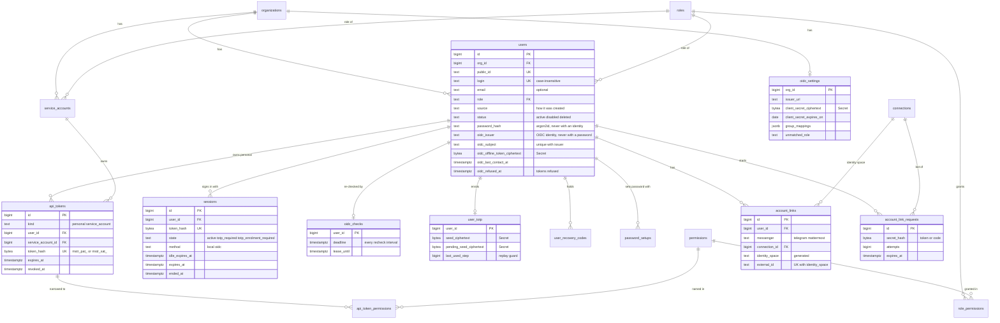
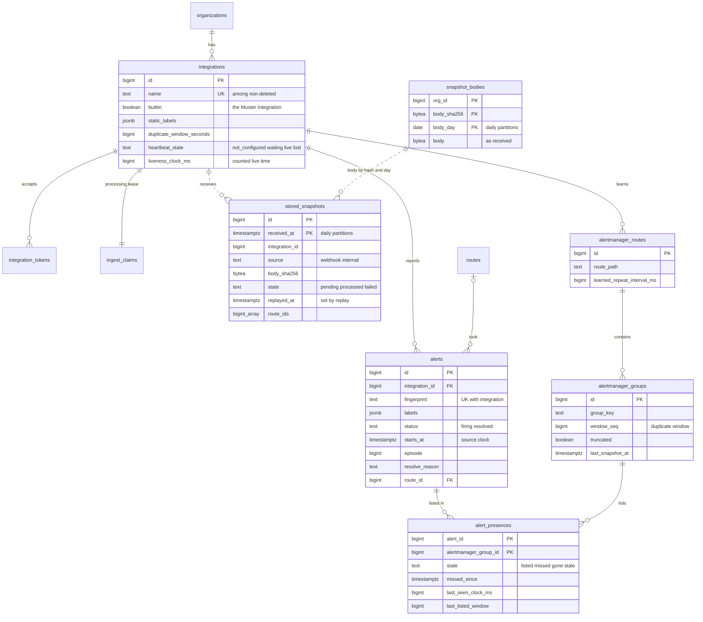
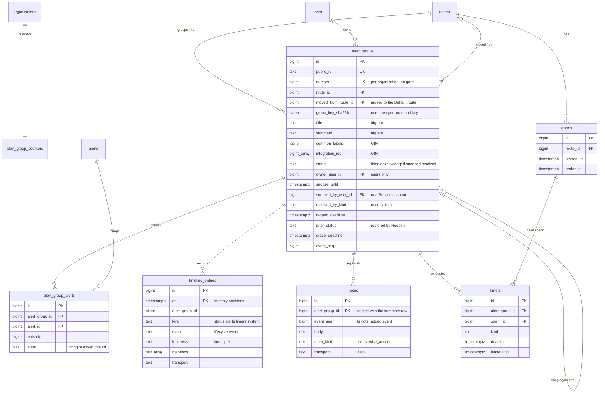
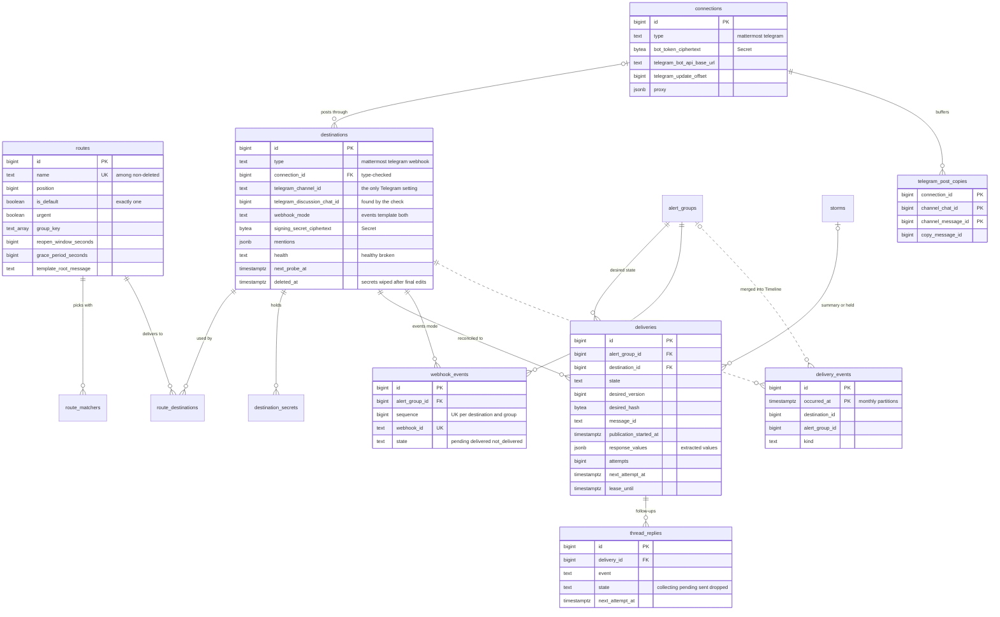
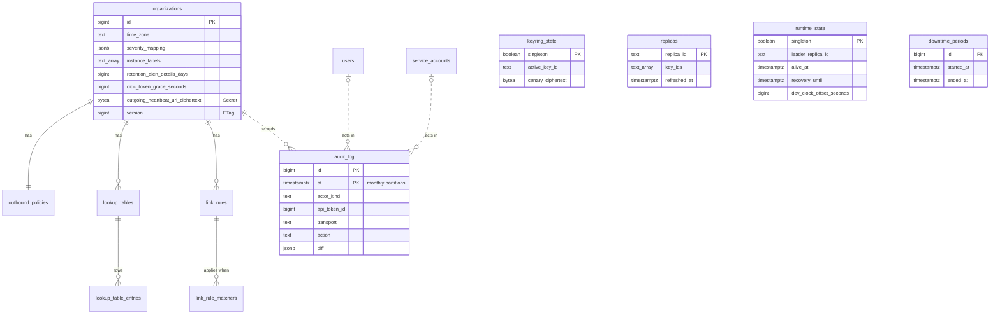

# Muster L1 — database schema

- Status: Draft; the first migration is embedded in the binary and applied by `muster migrate`
- Date: 2026-10-03
- Migrations: [`0001_init.up.sql`](../../internal/db/migrations/0001_init.up.sql) and
  [`0001_init.down.sql`](../../internal/db/migrations/0001_init.down.sql), then
  [`0002_stored_snapshots_replayed_at`](../../internal/db/migrations/0002_stored_snapshots_replayed_at.up.sql)
  (`stored_snapshots.replayed_at`, S-021) and
  [`0003_alert_groups_firing_again_after_on_delete`](../../internal/db/migrations/0003_alert_groups_firing_again_after_on_delete.up.sql)
  (`alert_groups.firing_again_after_id` `ON DELETE SET NULL`, S-029) and
  [`0004_thread_replies_pending_index`](../../internal/db/migrations/0004_thread_replies_pending_index.up.sql)
  (`thread_replies_pending_idx`, S-065) and
  [`0005_webhook_events_received_at`](../../internal/db/migrations/0005_webhook_events_received_at.up.sql)
  (`webhook_events.received_at`, S-044), in `internal/db/migrations/` — golang-migrate
  format, hand-written SQL,
  embedded in the binary, the same directory `sqlc` reads
  ([ADR-0006](../adr/0006-postgresql-only-storage-and-queues.md))
- PostgreSQL 14 or newer; one extension, `pg_trgm`

This document explains the physical schema of L1: every table group with its purpose, key columns, invariants, indexes,
partitioning and retention, and the capability and ADR it serves. Terms follow [`CONTEXT.md`](../../CONTEXT.md); the
conceptual model it implements is section 6 of [`architecture.md`](../architecture.md). Capability ids (`C-NN`) refer to
the files under [`prd/l1/`](../prd/l1/); `area.setting` names refer to [`defaults.md`](../prd/l1/defaults.md).

Contents: [1. Conventions](#1-conventions) · [2. Inventory](#2-inventory) · [3. Diagrams](#3-entity-relationship-diagrams) ·
[4. Table groups](#4-table-groups) · [5. Queues and claims](#5-queues-and-claims) ·
[6. Partitions and retention](#6-partitions-and-retention) · [7. Decisions](#7-decisions-and-alternatives) ·
[8. Validation](#8-validation) · [9. Resolved design questions](#9-resolved-design-questions)

---

## 1. Conventions

**Keys.** Every table has an internal `bigint GENERATED ALWAYS AS IDENTITY` key that never leaves the server. Resources
exposed through the API carry an opaque `public_id`, unique per Organization: `UNIQUE (org_id, public_id)`. It is
generated in Go: a two-letter type prefix and 12 random characters of Crockford base32 (60 bits), stored in canonical
upper case, for example `AGK7M3QX9P2RTA`; the API accepts any case and normalizes `O` to `0` and `I`, `L` to `1` before
the lookup. A `CHECK` on every `public_id` column pins its table's prefix and the alphabet — a regular expression per
column rather than a domain, which `sqlc` cannot read; `api_tokens` ties the prefix to the token kind (`PT` or `ST`).
The prefix table is in [`api/README.md`](../../api/README.md#public_id-format). URLs, the API and signed buttons use
`public_id`; people use the Alert Group number `#N` ([ADR-0003](../adr/0003-route-first-then-group-by-label-list.md),
[ADR-0008](../adr/0008-spec-first-openapi-and-api-conventions.md)). On partitioned tables `public_id` is indexed but
cannot be unique across partitions (a unique index must include the partition key); its randomness carries uniqueness.

**Organization scope.** Every organization-scoped table has `org_id bigint NOT NULL REFERENCES organizations (id)` from
day one, although L1 has a single Organization, and every query filters by it — the architecture lint parses the
queries ([ADR-0016](../adr/0016-flat-domain-packages-command-layer-and-architecture-lints.md)). Indexes used by
org-scoped queries lead with `org_id`. Installation-level tables have no `org_id`, on purpose: `roles`, `permissions`,
`role_permissions` (reference data), `keyring_state`, `replicas`, `runtime_state` and `downtime_periods` (one Muster
installation, one Keyring, one Leader). Authentication lookups cannot start from an Organization, because the request
carries only a secret or an id from a path: session cookies, API tokens, Integration tokens, password setup and Telegram
link tokens are found by their hash alone (each hash column is globally unique), and messenger callbacks by the
Connection in their path; these queries yield the Organization and are the lint's allow-list. Background work is not
on that list: worker claims, Leader scans, retention deletes and pruning run per Organization — they iterate over the
Organizations (one in L1) and pass `org_id` to every query, as the claims of [section 5](#5-queues-and-claims) show.

**Time.** Every timestamp is `timestamptz` and is passed from Go, so tests drive windows and timers with a virtual clock
([ADR-0006](../adr/0006-postgresql-only-storage-and-queues.md)). No business column has a `now()` default. The single
exception is `audit_log.recorded_at DEFAULT now()`: a database-side receipt time next to the business time `at`, kept
for tamper evidence. Durations are stored as integer seconds (`*_seconds`) or, for the liveness clock, milliseconds
(`*_ms`), matching the API conventions.

**Closed value sets** (statuses, kinds, Transports, error classes, Mention names, lifecycle events) are `text` with a
`CHECK`, not `ENUM` types. Widening a set later is an expand/contract migration that replaces the `CHECK`
(`NOT VALID`, then `VALIDATE`), instead of `ALTER TYPE ... ADD VALUE`, which cannot be undone. Go keeps typed constants;
CI compares them with the `CHECK` lists.

**Secrets** ([ADR-0011](../adr/0011-application-level-secret-encryption.md)) are never stored in plaintext. Each secret
field is a triple `<name>_ciphertext bytea` (AES-256-GCM), `<name>_key_id text` (the Keyring key that encrypted it) and
`<name>_updated_at` (for the API's "set, and when it last changed"); a `CHECK` keeps ciphertext and key id together. The
view [`encrypted_values`](#414-encrypted_values-view) lists every encrypted value with its key id. Tokens Muster issues
(`mstr_pat_`, `mstr_sat_`, `mstr_int_`, session cookies, password setup links, link tokens and codes) are stored only as
32-byte SHA-256 hashes; they are high-entropy and only ever verified. TOTP recovery codes are short, so they are hashed
with argon2id (PHC string) instead.

**Optimistic locking.** Configuration rows carry `version bigint` (default 1). The ETag is derived from it; an update is
`... SET version = version + 1 WHERE id = $1 AND version = $2`, and zero updated rows is a `412`
([ADR-0008](../adr/0008-spec-first-openapi-and-api-conventions.md)). The Route list has its own
`organizations.route_order_version`, because its ETag covers the order. Runtime columns on configuration rows (Heartbeat
state, health, counters) never touch `version`.

**Soft deletion** is used where history keeps pointing at a row: Integrations, Routes, Connections, Destinations,
Service accounts (`deleted_at`) and Users (`status = 'deleted'`, pseudonymized). Unique names are partial indexes
`WHERE deleted_at IS NULL`, so a name can be reused. Nothing in L1 hard-deletes these rows. A deleted Destination keeps
its row but loses its secrets once the final edits of its open Root messages are done
([4.5](#45-connections-destinations-and-account-links)). A deleted Connection loses its bot token (and proxy password)
at once: `connections_bot_token_check` allows a missing token only on a deleted row.

**One writer per table.** The architecture lint "only `groups` writes Alert Group tables" applies to `alert_groups`,
`alert_group_alerts`, `timeline_entries`, `notes` and `alert_group_counters`. Snapshot processing (`ingest`) writes the
Snapshot tables and `alerts`; `delivery` writes the delivery tables and `delivery_events`, called inside the
dispatcher's transaction for the re-render step; `audit` appends to `audit_log`.

**Migrations.** The file runs in one transaction and starts with `SET LOCAL lock_timeout` and `statement_timeout`;
later migrations keep that pattern and follow expand/contract
([ADR-0006](../adr/0006-postgresql-only-storage-and-queues.md)). The migration creates no data except the reference
rows of `roles`, `permissions` and `role_permissions`. The Organization and its companions — the outbound policy, the
Default route, the built-in "Muster" Integration, the built-in "Explore" Link rule, the Keyring state with the canary
and the bootstrap Admin — are created by Go at first start under the migration advisory lock, with the values of
`defaults.md` (C-02.FR-7, C-02.FR-23, C-03.FR-22). The `alert_group_counters` row is the exception: `groups`, its only
writer, creates it with the first Alert Group ([4.2](#42-organization)).

## 2. Inventory

57 tables (5 of them partitioned) and 1 view; 90 explicit indexes in the migration.

| Group | Tables | Writer | Retention |
|---|---|---|---|
| Reference data | `roles`, `permissions`, `role_permissions` | migrations | — |
| Platform state | `keyring_state`, `replicas`, `runtime_state`, `downtime_periods` | runtime, Leader, CLI | stale replicas pruned |
| Organization | `organizations`, `outbound_policies`, `alert_group_counters` | organization; `alert_group_counters` only `groups` | — |
| Users and sign-in | `users`, `user_totp`, `user_recovery_codes`, `sessions`, `sign_in_throttles`, `password_setups`, `oidc_auth_requests`, `oidc_settings`, `oidc_checks` | users / auth | expired rows pruned |
| API tokens | `service_accounts`, `api_tokens`, `api_token_permissions` | users / auth | — |
| Messengers | `connections`, `destinations`, `destination_secrets`, `account_links`, `account_link_requests` | destinations, account links | expired requests pruned |
| Ingestion | `integrations`, `integration_tokens`, `ingest_claims`, **`stored_snapshots`**, **`snapshot_bodies`** | integrations, ingest | 14 days, daily partitions |
| Snapshot semantics | `alertmanager_routes`, `alertmanager_groups`, `alerts`, `alert_presences` | ingest, routing | 90 days after resolution, batched delete |
| Routing | `routes`, `route_matchers`, `route_destinations`, `route_suggestion_dismissals` | routing | — |
| Alert Groups | `alert_groups`, `alert_group_alerts`, **`timeline_entries`**, `notes` | `groups` only | summaries and their Notes 2 years; details 90 days |
| Timers and Storms | `timers`, `storms` | `groups`, timers, delivery | queue rows deleted when done |
| Delivery | `deliveries`, `thread_replies`, `webhook_events`, **`delivery_events`**, `telegram_post_copies`, `rate_limit_buckets` | delivery | events 90 days, monthly partitions |
| Links | `lookup_tables`, `lookup_table_entries`, `link_rules`, `link_rule_matchers` | messages | — |
| Audit | **`audit_log`** | audit | 1 year, monthly partitions, append-only |
| View | `encrypted_values` | — | — |

## 3. Entity-relationship diagrams

Physical tables with their main columns. A solid line is a foreign key; a dotted line is a reference without a foreign
key, kept by the single writer — used for partitioned tables, which reference only `organizations`
([section 7](#7-decisions-and-alternatives)). `organizations` is drawn only where it owns top-level configuration; every
table carries `org_id`.

### 3.1 Identity and access



### 3.2 Ingestion and Alerts



### 3.3 Alert Groups and timers



### 3.4 Routing and delivery



### 3.5 Configuration, audit and platform



## 4. Table groups

### 4.1 Reference data and platform state

Serves C-02, C-03.FR-2, C-20.FR-6–7; [ADR-0007](../adr/0007-active-replicas-with-advisory-lock-leader.md),
[ADR-0011](../adr/0011-application-level-secret-encryption.md).

- **`roles`, `permissions`, `role_permissions`** — the three fixed Roles, the closed Permission set of the API
  specification and the default allocation of [reference.md](../prd/l1/reference.md#roles-and-permissions), seeded by
  the migration. Permission checks are made against Permissions, never Roles (C-03.FR-2); the application loads the
  allocation at startup and a test compares the seed with the reference matrix. The allocation was confirmed with the
  C-03 sign-in story (P-42); changing it is a new migration. `users.role`, `service_accounts.role` and `api_token_permissions.permission` are
  foreign keys into these tables, so an unknown Role or Permission cannot be stored.
- **`keyring_state`** (singleton) — the active key id and the key canary. `CHECK (canary_key_id = active_key_id)`
  encodes the rule that activation re-encrypts the canary in the same transaction, so removing an old key never breaks
  startup. Written under the migration lock at first start and by `muster secrets rotate-key`.
- **`replicas`** — one row per running replica: the key ids it holds and `refreshed_at`, refreshed every
  `replica.key_record_refresh`; a replica is live while the row is younger than `replica.live_expiry`. Activation
  refuses when a live replica lacks the key; the System status page lists live replicas. Rows not refreshed for
  `replica.prune_after` are pruned by the Leader. `started_at` is the start of the replica, or of its latest
  registration: a replica that could not refresh its row for longer than `leader.absence_notice` (it lost the database)
  re-registers with a new `started_at` when it reaches the database again.
- **`runtime_state`** (singleton) — the Leader's alive mark (`alive_at`, every `leader.alive_mark_interval`), who leads,
  and `recovery_until`, the end of the "recovering after downtime" notice. The "no replica is leading" notice is derived
  from `alive_at` older than `leader.absence_notice`. `dev_clock_offset_seconds` is the offset of the development clock
  of `muster dev`, kept here so that every replica of a development database runs on one clock; it is written only in
  development mode and stays 0 elsewhere.
- **`downtime_periods`** — each period without an alive mark, recorded by the next Leader (C-02.FR-12): the source of
  the downtime log event, the recovery window and the "Muster was unavailable" Timeline entries (C-09.FR-18). A period
  starts at the later of the last alive mark and the last record refresh of another replica that ran across it (whose
  `replicas.started_at` is no later than `leader.absence_notice` after the mark), so that time while replicas ran
  without a Leader is not downtime; `started_at` is that start, not always the mark.

### 4.2 Organization

Serves C-02.FR-21–23, C-03.FR-20, C-19.FR-7, C-20; [ADR-0003](../adr/0003-route-first-then-group-by-label-list.md),
[ADR-0015](../adr/0015-outbound-http-and-ssrf-policy.md).

- **`organizations`** — the `organization` resource: time zone, Severity levels (`severity_label`, `severity_mapping`,
  `severity_styles` as JSON arrays), "critical is Urgent", Instance labels, the four retention periods in days, the TOTP
  policy, the token grace for OIDC accounts (`auth.oidc_token_grace`) and the outgoing heartbeat (URL as a Secret, its
  proxy, and the last result for System status). Invariant:
  `retention_alert_group_summaries_days >= retention_alert_details_days`, because details always go before the summary
  rows they belong to; the API refuses the opposite with `422` (`retention_order`) before it reaches the database.
- **`outbound_policies`** — the outbound address policy (`standard` or `strict`) with its allowed and denied lists of
  networks, host names and domains, a resource with its own ETag (`organization/outbound-policy`). Rules that always
  apply (link-local, metadata, unspecified, multicast) are code, not data.
- **`alert_group_counters`** — one row per Organization for `#N` without gaps: the transaction that creates an Alert
  Group runs `INSERT INTO alert_group_counters (org_id) VALUES ($1) ON CONFLICT (org_id) DO NOTHING`, which creates the
  row on first use, then
  `UPDATE alert_group_counters SET last_number = last_number + 1 WHERE org_id = $1 RETURNING last_number`. Both
  statements are in `internal/groups`, the table's only writer (lint 2); no start-up step creates the row.
  The row lock serializes creations and Reopens per Organization (a Storm of 300 Alert Groups per minute is far below
  what one row lock sustains), and a rollback returns the number, so no gap appears. A sequence would leave gaps.
  Grouping takes the row only when a Snapshot's Alerts need a new or a reopened Alert Group; Alerts that join open
  Alert Groups lock those rows alone, and a join that finds its Alert Group resolved after the lock rolls back to a
  savepoint and groups again under the counter row, so that no lookup after an Alert Group lock needs it.

### 4.3 Users, sign-in and sessions

Serves C-03 (FR-3–FR-27), C-18.FR-8; [ADR-0008](../adr/0008-spec-first-openapi-and-api-conventions.md),
[ADR-0010](../adr/0010-configuration-only-through-the-api.md), [ADR-0011](../adr/0011-application-level-secret-encryption.md).

- **`users`** — local, OIDC and bootstrap users. `login` is stored as entered; uniqueness (`lower(login)`) and sign-in
  compare it lowercased, so logins are case-insensitive. The IdP is the only source of truth for an OIDC account, so an
  account holds one credential at most (`CHECK`): a password (`password_hash`, an argon2id PHC string) or an OIDC
  identity (`oidc_issuer` and `oidc_subject`, set together, one account per identity). A local account waits for its
  first password with neither. `source` only records how the account was created. An account is never merged with an
  identity by login or email: the first OIDC sign-in of an identity creates a user with the login from
  `preferred_username`, the email or `sub`, and is refused as `login_taken` when that login exists. Linking an identity
  from the account's web session sets it and wipes the password in one update. An Admin's conversion to local, and
  `muster admin reset-password` — the emergency access, which sets a password on any account — remove the identity in
  the same update, which keeps the `CHECK` without an exception for the CLI. When the IdP grants `offline_access`, the
  user's offline token is kept here as a Secret (`oidc_offline_token_*`), replaced at each OIDC sign-in and never
  returned by the API; a `CHECK` allows it only on an active account with an OIDC identity, so disabling, deleting and
  converting the user must wipe it. `oidc_last_contact_at` is the last successful OIDC sign-in or background re-check.
  `oidc_refused_at` marks a refusal by the IdP: the user's Personal access tokens are refused until the next OIDC
  sign-in clears it. For a user without an offline token, Personal access tokens work while the last OIDC sign-in is
  within `organizations.oidc_token_grace_seconds`. Deleting a user sets `status = 'deleted'`, renames it
  `deleted-user-<id>` (login too, freeing the unique login) and erases the email (`CHECK`); the row stays because Alert
  Groups, the Timeline and the Audit log point at it and show "(deactivated)".
- **`user_totp`** — the TOTP seed (a Secret) once enrolled, and a pending seed between "enrol" and "confirm", so
  re-enrolment never loses the active factor before the new one is confirmed. `last_used_step` rejects a replayed code.
- **`user_recovery_codes`** — single-use codes, argon2id-hashed; regenerating deletes the unused ones.
- **`sessions`** — sessions in PostgreSQL (C-03.FR-9): the cookie value hashed, `state` (`active`, `totp_required`,
  `totp_enrolment_required`), idle and absolute expiry, `ended_at` with the reason (password change, disable, Role
  change, sign out everywhere, OIDC linked, conversion to local, refused by the IdP). The CSRF token is derived from the
  session token with a Keyring sub-key and not stored. `last_used_at` is refreshed at most once a minute to avoid a
  write per request. A session holds no IdP token: OIDC users are re-checked per user (`oidc_checks`), and a refusal
  ends all of the user's sessions. An OIDC session of a user without an offline token gets `expires_at` at most
  `auth.oidc_fallback_session_lifetime` after sign-in.
- **`oidc_checks`** — the background re-checks of OIDC users at the IdP: one row per user who holds an offline token,
  due every `auth.oidc_recheck_interval`, claimed by any replica with `FOR UPDATE SKIP LOCKED` and a lease like a timer
  (section 5), so one check per user runs at a time and a rotated refresh token is never refreshed twice. A user
  without a live session or a usable Personal access token is skipped without calling the IdP. Deleting the user, or
  wiping the offline token, removes the row.
- **`sign_in_throttles`** — consecutive failures and `blocked_until` per account and per source address
  (`auth.signin_throttle`), shared by all replicas. The account subject is the SHA-256 of the lowercased login in hex,
  so that its key has a fixed size; the address subject is an IPv4 address or the /64 network of an IPv6 address.
- **`password_setups`** — single-use setup links: token hash, expiry (`auth.password_setup_link_ttl`), `used_at`, and
  `superseded_at` when a newer link replaced it, a newer reset, or the deletion of the user (all answer `410
  link_used`). A row is deleted `auth.password_setup_prune_after` past its expiry.
- **`oidc_auth_requests`** — in-flight OIDC redirects, keyed by the hash of `state` and valid for
  `oidc.auth_request_ttl`, with the nonce, the PKCE verifier (a Secret) and a `return_to` that a `CHECK` restricts to a relative path (no `//host`, no `/\host`). In the database
  because the callback may reach another replica. `purpose` is `sign_in` or `link`; a link names the account
  (`link_user_id`) and the web session (`link_session_id`) that started it, and its callback is accepted only from that
  session, so an identity cannot be linked into someone else's account through a forged callback.
- **`oidc_settings`** — one row once configured: issuer, client, client secret (Secret) and its optional expiry date
  (`MusterOIDCSecretExpiring`), scopes, groups claim, group-to-Role mappings, the unmatched Role, the switches, the
  proxy, and the time since which the last check found no groups claim (warning `groups_claim_missing`).

### 4.4 Service accounts and API tokens

Serves C-04; [ADR-0011](../adr/0011-application-level-secret-encryption.md).

- **`service_accounts`** — name (unique among non-deleted), Role, `active`/`disabled`/`deleted`. A Service account can
  never be an Owner: `alert_groups.owner_user_id` references `users` only.
- **`api_tokens`** — Personal access tokens and Service account tokens in one table, so authentication is one lookup by
  hash and the Audit log references one table. `CHECK` ties `kind` to exactly one owner. The token prefix (`mstr_pat_`,
  `mstr_sat_`) tells the authenticator the kind before the lookup and lets scanners find leaked tokens. `last_used_at`
  and `last_used_address` are refreshed at most once a minute. `revoked_reason = 'owner_deleted'` records the revocation
  that follows deleting a user. A Personal access token of an OIDC account is refused, not revoked, while its owner's
  `users.oidc_refused_at` is set or, for an owner without an offline token, while the last OIDC sign-in is older than
  the token grace.
- **`api_token_permissions`** — the Permissions a Personal access token is narrowed to; effective Permissions are the
  intersection with the owner's current Role (C-04.FR-1), computed at request time.

### 4.5 Connections, Destinations and Account links

Serves C-11.FR-18, C-12.FR-8, C-13, C-14, C-15, C-18; [ADR-0005](../adr/0005-delivery-as-desired-state-reconciliation.md),
[ADR-0013](../adr/0013-account-links-from-web-session-only.md), [ADR-0015](../adr/0015-outbound-http-and-ssrf-policy.md).

- **`connections`** — a Mattermost bot (server URL) or a Telegram bot (Bot API base URL, update mode). The bot token,
  the proxy password and the Telegram webhook secret token are Secrets; the proxy settings object of C-03.FR-19 is
  `proxy jsonb` (`{"enabled", "type", "address", "username"}`) next to the password triple — the same shape on
  `connections`, `destinations`, `oidc_settings` and the outgoing heartbeat. `telegram_update_offset` lets a new Leader
  resume `getUpdates` where the old one stopped. `UNIQUE (id, type)` is the target of type-checked foreign keys. A
  Connection cannot be deleted while a Destination that is not deleted uses it; deleting it abandons the final edits
  still pending for its deleted Destinations, whose deliveries end as `not_delivered`.
- **`destinations`** — one table for the three types, with type-specific nullable columns and a `CHECK` per type. The
  composite foreign key `(connection_id, type) REFERENCES connections (id, type)` guarantees that a Mattermost
  Destination posts through a Mattermost Connection and a Telegram one through a Telegram Connection; an outgoing
  webhook has no Connection. Outgoing webhooks keep their request templates as `jsonb` (`webhook_events_config`,
  `webhook_template_config`, matching `WebhookEventsConfig` and `WebhookTemplateConfig`), their own proxy, and the
  current and previous Signing secrets (the previous one with `previous_signing_secret_since`, shown as "still signs
  since"); a `CHECK` requires a Signing secret on every outgoing webhook that is not deleted, because it is generated at
  creation. A Telegram Destination stores only its channel as entered (`telegram_channel_id`); the numeric channel id,
  the channel's linked discussion group (`getChat` → `linked_chat_id`, in `telegram_discussion_chat_id`) and their
  titles are learned by the Destination check. **Health**: `health`, `broken_since`, `broken_cause` (`fatal` or
  `unavailable`), `broken_reason` (masked) and `next_probe_at`; the `CHECK` keeps them consistent. `mentions` holds the
  Mention settings per kind of Loud event. The template error state of an outgoing webhook request is kept here
  (`MusterTemplateError`). **Deletion** is soft: `deleted_at` is set and the Destination leaves its Routes; its open
  Root messages get their final edit (`deliveries.desired_retire`), and then its secrets — the Signing secrets, the
  proxy password and its `destination_secrets` rows — are wiped. An outgoing webhook in events mode has no Root message:
  its pending `webhook_events` end as `not_delivered`, no final event is sent and its secrets are wiped at once. The row
  stays for the deliveries, events and Audit log entries that point at it.
- **`destination_secrets`** — the named Secrets of an outgoing webhook, referenced as `{{ .Secrets.<name> }}`; the name
  is checked to be a template identifier.
- **`account_links`** — the identity space is a stored generated column: `'telegram'` for every Telegram link,
  `'mattermost:<connection_id>'` for a Mattermost one. Two unique constraints carry the rules of ADR-0013:
  `(org_id, identity_space, external_id)` — one messenger account belongs to one User — and
  `(org_id, user_id, identity_space)` — one account per space per User; a new link replaces the old one in one
  transaction (delete, insert, Audit log). The composite foreign key `(connection_id, messenger)` makes a Telegram link
  name a Telegram Connection.
- **`account_link_requests`** — pending links started from the web session: the hashed Telegram token (looked up by
  hash alone when `/start` arrives, so it has a unique partial index) or the hashed Mattermost code with its target
  account and `attempts` (`account_link.mattermost_code`). Two indexes back the request limits per requesting User and
  per target account (`account_link.mattermost_code_requests`).

### 4.6 Integrations and ingestion

Serves C-05, C-06.FR-1, C-06.FR-17, C-06.FR-20, C-07; [ADR-0002](../adr/0002-webhook-only-ingestion-with-snapshot-semantics.md),
[ADR-0006](../adr/0006-postgresql-only-storage-and-queues.md).

- **`integrations`** — name (unique among non-deleted), the Connection mode (`webhook_only`), Static labels, the
  duplicate window, the Heartbeat settings and state (`not_configured`, `waiting`, `live`, `lost` with
  `heartbeat_lost_since`), and `builtin` for the "Muster" Integration (exactly one per Organization, never deleted,
  never with a Heartbeat). `liveness_clock_ms` is explained in 4.7. `snapshot_count` and `last_snapshot_at` are
  maintained by processing, as the last statement of each Snapshot's transaction, so the ingestion handler never
  updates the Integration row and stays insert-only; a Snapshot that changes the truncation of a `groupKey` locks the
  row just before, so that the Integration's `MusterSnapshotTruncated` is decided in one order.
- **`integration_tokens`** — `mstr_int_` tokens as hashes; ingestion and Heartbeat look them up by hash alone.
  `last_used_at` is refreshed at most once a minute, never on every webhook (50 webhooks per second would otherwise
  serialize on one row).
- **`ingest_claims`** — one row per Integration holding the processing lease (`lease_owner`, `lease_until`): one
  replica processes an Integration at a time, at most one Stored Snapshot per Alertmanager group and up to
  `processing.parallel_groups` of them (C-06.FR-1). The holder renews the lease; each Snapshot's transaction checks it
  with `FOR KEY SHARE`, which leaves the renewal free and makes another replica's claim skip the row. See
  [section 5](#5-queues-and-claims).
- **`stored_snapshots`** (partitioned by day on `received_at`) — the ingestion queue itself: one row per accepted
  request with its processing state (`pending`, `processed`, `failed` with `processing_error`; the `CHECK` keeps
  `processed_at` and the error consistent, and replay resets both and sets `replayed_at`, so that processing counts a
  Stored Snapshot in `integrations.snapshot_count` only when it leaves `pending` for the first time). Values read
  during processing (`group_key`, `alert_count`, `truncated_alerts`) and the Routes that took its Alerts (`route_ids`,
  GIN-indexed for template dry runs over "the most recent Stored Snapshots that the Route took", C-12.FR-5) are written
  back. `source = 'internal'` marks raises and resolves of Internal alerts ([section 7](#7-decisions-and-alternatives))
  and the marker that `deleteIntegration` writes into the queue of the deleted Integration (C-06.FR-16).
  Indexes: the partial `(org_id, integration_id, received_at, id) WHERE state = 'pending'` gives processing order per
  Integration and stays tiny; `(org_id, integration_id, received_at DESC, id DESC)` serves the Stored Snapshot list with
  cursor pagination and the time of the last Snapshot.
- **`snapshot_bodies`** (partitioned by day on `body_day`) — the bodies, exactly as received (`bytea`, so any bytes up
  to `ingest.body_limit` are kept; the API returns `utf8` or `base64`), de-duplicated by SHA-256 per Organization and
  UTC day: `INSERT ... ON CONFLICT DO NOTHING` in the ingestion transaction. A Stored Snapshot points at its body by
  `(org_id, body_sha256, body_day)`, and a `CHECK` ties `body_day` to the UTC day of `received_at`, so the two tables
  are partitioned on the same days and dropped together.

Ingestion is one short transaction: insert the body (or find it), insert the Stored Snapshot, `NOTIFY`, commit, answer
`202`. Nothing is parsed and nothing else is updated on that path.

### 4.7 Snapshot semantics: Alertmanager routes and groups, Alerts, presence

Serves C-06, C-07.FR-5, C-08.FR-13; [ADR-0002](../adr/0002-webhook-only-ingestion-with-snapshot-semantics.md).

- **`alertmanager_routes`** — an Alertmanager route of an Integration (the route part of `groupKey`, stored with a hash
  for the unique key because `groupKey` can be long). `learned_repeat_interval_ms` is null until learned (then
  `stale_after` is `processing.stale_after_unlearned`); `recent_repeat_gaps_ms` keeps a short ring of observed gaps from
  which the interval (their median) is computed. Serves `integrations/{id}/alertmanager-routes` (C-06.FR-18).
- **`alertmanager_groups`** — one `groupKey` of an Integration:
  - **duplicate window**: `window_seq`, `window_started_at`, `window_truncated`. Snapshots arriving within the
    Integration's duplicate window of `window_started_at` belong to the same window; a later Snapshot opens window
    `window_seq + 1`. A window that contained a truncated Snapshot proves no absence.
  - **truncation**: `truncated`, `truncated_since` (`CHECK` keeps them together). The partial index on truncated groups
    answers "is any `groupKey` of this Integration truncated" (`MusterSnapshotTruncated`, the warning, the count in
    `AlertmanagerRoute.truncated_group_count`). Truncation also expires when no Snapshot has arrived for `stale_after`
    counted like staleness, hence `last_snapshot_clock_ms`.
  - **repeat learning**: `last_repeat_at` (Snapshots whose `notification_reason` marks a repeat) and
    `last_content_sha256`, `last_content_at` (fingerprints and statuses, for the fallback of identical Snapshots).
- **`alerts`** — one row per Integration and fingerprint (`UNIQUE (integration_id, fingerprint)`): labels with Static
  labels applied (and `static_label_conflicts`), annotations, `generatorURL`, `status`, `starts_at`/`ends_at` on the
  source clock, `fired_at`/`first_seen_at`/`last_seen_at` on Muster's clock, the resolution and its reason
  (`resolved`, `gone`, `stale`, `integration_deleted`, with the full text), and routing of the current firing
  (`route_id`, `severity_level`, `severity_raw`). Idempotency per Alert on `fingerprint + status + startsAt` compares
  with this row. A new firing after a resolution reuses the row and increments `episode`; a Continuation (new
  `startsAt`, no resolve in between) only updates `starts_at`. This is the Alerts view of an Integration (C-06.FR-19):
  indexes for sorting by `last_seen_at` or `starts_at` with cursor `(value, id)`, GIN on `labels` for label filters.
  Internal alerts are the rows of the built-in Integration, deduplicated by fingerprint through the same unique key.
- **`alert_presences`** — the presence of an Alert in one `groupKey`: `state` (`listed`, `missed`, `gone`, `stale`),
  `last_seen_at`, `last_listed_window`, `last_seen_clock_ms` and `missed_since`, the receipt time of the first window
  that missed it (set only while `missed`; `CHECK` keeps them together). An Alert listed in several Alertmanager groups
  has several rows and resolves by absence only when every row is `gone` or `stale` (C-06.FR-7). Absence is decided on
  receipt of each Snapshot that is not truncated, never when a window closes: the partial index over active rows of a
  `groupKey` finds the rows not listed in the current window; a `listed` one becomes `missed` with `missed_since` = the
  start of that window, and one already `missed` in an earlier window becomes `gone` as soon as a Snapshot arrives at
  least `processing.gone_min_absence` after `missed_since` — so Gone is decided by the second missing Snapshot
  (C-06.FR-5, C-06.AC-1, C-06.AC-2). The partial index over `(org_id, integration_id, last_seen_clock_ms)` drives the
  Leader's Stale scan.

**The liveness clock.** Staleness must count only time during which the Integration's path was alive: never time with a
lost Heartbeat, "from the last signal before the loss until the signal returns", and never time while Muster was down
(C-06.FR-9, C-07.AC-4). Instead of subtracting pause intervals, each Integration has `liveness_clock_ms`, a logical
clock that advances only between Heartbeat signals: when a signal arrives within `heartbeat_timeout_seconds` of the
previous one, the gap is added; when the gap was longer (the Heartbeat was lost, or Muster could not receive anything
because it was down), nothing is added. A Muster downtime shorter than the Heartbeat timeout is therefore not told apart
from a normal gap and counts; C-06.FR-9 accepts this: the error is at most the timeout, 5 minutes by default, against a
`stale_after` of at least three learned repeat intervals, and subtracting `downtime_periods` from each gap was rejected
as bookkeeping for no practical gain. A presence stores the clock value when it was last listed, and an Alert is Stale
in a `groupKey` when `liveness_clock_ms (+ time since the last signal, while live) - last_seen_clock_ms` exceeds
`stale_after` of its Alertmanager route. With the numbers of C-07.AC-4 — a 5-minute interval and no signal from T to
T+10 min — the clock stands still for those 10 minutes and the Alert goes Stale at T+25 min. An Integration without a
Heartbeat, or still waiting for its first signal, never advances its clock and therefore never stales anything. The
Leader's Heartbeat check (C-07.FR-4) measures the timeout from the later of `heartbeat_last_signal_at` and, when the
current Leader recorded a downtime on taking over, `runtime_state.leader_since`: Muster's own outage does not make every
Integration Heartbeat lost, and the first signal after an outage longer than the timeout adds nothing to the clock.

### 4.8 Routes

Serves C-08, C-09.FR-19, C-11.FR-14, C-12, C-17; [ADR-0003](../adr/0003-route-first-then-group-by-label-list.md),
[ADR-0004](../adr/0004-alert-group-state-machine.md).

- **`routes`** — name (unique among non-deleted), `position`, `is_default` (exactly one per Organization through a
  partial unique index; never deleted), `urgent`, `group_key text[]`, and every policy field as its own typed column
  (Reopen window, Grace period, rise-to-Urgent rule, Snooze durations, Thread batching window, Storm threshold,
  language, the three templates, ack timeout, Reminders with `CHECK (cap >= first)`, auto-unacknowledge) — not a JSON
  blob, so every field has a `CHECK`. All of them exist from the first migration and every Route stores them from its
  creation (C-08.FR-1); each capability brings the behaviour of its fields, not their columns. Route profiles only
  pre-fill these columns and are not stored (C-08.FR-7). The template error state (`MusterTemplateError`) of a Route's
  message templates is kept on the row. Routes are soft-deleted because two-year summary rows of Alert Groups point at
  them; deletion with open Alert Groups is refused by the application (C-09.FR-19), using the open-key index of
  `alert_groups`. Evaluation order is `ORDER BY is_default, position, id`; a reorder rewrites `position` in one
  transaction and bumps `organizations.route_order_version`. `position` is deliberately not unique: a unique index
  cannot be deferred, and a reorder would collide halfway.
- **`route_matchers`** — Matchers of a Route, `op` checked against `=`, `!=`, `=~`, `!~`; replaced as a whole on update.
  The Default route has none (enforced by the routes package; a trigger was not worth it).
- **`route_destinations`** — Destinations of a Route with `added_at`, which drives the Quiet publication of the Route's
  open Alert Groups into a newly added Destination (C-11.FR-14).
- **`route_suggestion_dismissals`** — suggestions (`heartbeat_lost`, `internal_alerts`) dismissed per user (C-08.FR-11).

### 4.9 Alert Groups, Alerts inside them and the Timeline

Serves C-09, C-10, C-17; [ADR-0004](../adr/0004-alert-group-state-machine.md),
[ADR-0016](../adr/0016-flat-domain-packages-command-layer-and-architecture-lints.md). Written only by `groups`, through
the dispatcher; every command and system transition locks the Alert Group row (`SELECT ... FOR UPDATE`), which
serializes commands on one Alert Group (C-10.FR-10).

**`alert_groups`** is at the same time the working row of an Alert Group and its **summary row**, kept for
`retention.alert_group_summaries` (2 years): the list, search, statistics, `#N` lookup and the "details removed" page
need nothing else. Its details — `alert_group_alerts`, `timeline_entries` and `delivery_events` — are separate tables
kept for `retention.alert_details` (90 days); its Notes (`notes`) are kept with the summary row and deleted with it.
Columns by concern:

| Concern | Columns |
|---|---|
| Identity | `number` (`#N`, unique per Organization), `public_id`, `route_id`, `moved_from_route_id` (set when the Alert Group was moved to the Default route), `group_key_labels` and `group_key_values` (the key as it was at creation), `group_key_sha256` |
| Display and search | `title`, `title_from_group_key` (the single allowed title switch, C-09.FR-23), `summary`, `common_labels`, `common_annotations`, `integration_ids` |
| Status | `status`, `severity_level`, `urgent`, `owner_user_id` and `acknowledged_at`, `first_acknowledged_at`, `snooze_until`, `snooze_no_end`, `snoozed_while_urgent`, `snoozed_by_user_id` or `snoozed_by_service_account_id` |
| Resolution | `resolved_at`, `resolved_by_kind` (`user` or `system`), `resolved_by_user_id` or `resolved_by_service_account_id` (the `ActorRef` kinds), `resolve_reason` and `resolve_reason_text` |
| Reopen window | `reopen_deadline`, `prior_status`, `prior_owner_user_id`, `prior_snooze_until`, `prior_snooze_no_end`, `prior_snoozed_while_urgent`, `prior_snoozed_by_user_id`, `prior_snoozed_by_service_account_id` |
| Grace period | `grace_deadline`, `firing_again_after_id` ("firing again after a manual resolve of #N"; `ON DELETE SET NULL` since migration 0003, so that summary retention can delete the earlier Alert Group) |
| Counters | `firing_alert_count`, `resolved_alert_count`, `reopen_count`, `event_seq` |
| Timers | `first_published_at`, `ack_timeout_started_at`, `ack_timeout_notices_sent`, `unclaimed`, `reminders_sent`, `reminders_unanswered`, `last_reminder_at`, `owner_answered_at` |
| Time | `created_at` (start), `last_changed_at` |

Invariants, enforced by `CHECK`:

- the Owner is set exactly while `acknowledged`, and is a User (foreign key to `users`; a Service account cannot own);
- while `snoozed`, exactly one of `snooze_until` and `snooze_no_end`, and exactly one snoozer (a User or a Service
  account); otherwise none of them, and no `snoozed_while_urgent`;
- `resolved` exactly when `resolved_at` is set; a person's resolve names exactly one User or Service account and no
  reason code; a system resolve names nobody and carries a reason;
- a Reopen window (`reopen_deadline`) only after a system resolve, with the status to return to (`prior_status`), and
  never on an Alert Group moved to the Default route; a Grace period (`grace_deadline`) only after a person's resolve;
- `unclaimed` only while `firing` (Unclaimed ends when the Alert Group stops being firing, C-17.FR-3).

`first_acknowledged_at` is set by the first acknowledgement and never changed afterwards — Takeover, Unacknowledge and
Reopen leave it — and gives the time to acknowledge of the statistics (C-09.FR-15); an Alert Group that was never
acknowledged has none and is left out of it. Who set the current Snooze ("Snoozed by" in the Root message,
`snoozed_by` in the API) is kept on the row: set by Snooze, restored with the Snooze by a Reopen into snoozed (from the
`prior_snoozed_by_*` columns), and cleared when the Snooze ends, so it never depends on Timeline retention.

Indexes and the queries they serve:

| Index | Query |
|---|---|
| `alert_groups_open_key` UNIQUE `(route_id, group_key_sha256) WHERE status <> 'resolved' AND moved_from_route_id IS NULL` | grouping: join the open Alert Group of a Route and key — and the invariant that there is at most one; Alert Groups moved to the Default route are left out |
| `alert_groups_reopen_idx` `(route_id, group_key_sha256) WHERE reopen_deadline IS NOT NULL` | Reopen: a system-resolved Alert Group with the same key inside its window |
| `alert_groups_related_idx` | previous Alert Groups with the same Route and key (C-09.FR-20) |
| `UNIQUE (org_id, number)` | search by `#N`, which ignores the time range |
| `alert_groups_open_idx` `(org_id, created_at DESC, id DESC) WHERE status <> 'resolved'` | the default tab (open Alert Groups, newest first) |
| `alert_groups_started_idx`, `alert_groups_changed_idx` | lists sorted by start or last change, cursor on `(created_at, id)` or `(last_changed_at, id)` |
| `alert_groups_resolved_idx` `(org_id, resolved_at) WHERE status = 'resolved'` | the time-range overlap (not resolved before `from`), resolved-by filters, summary retention |
| `alert_groups_route_idx` | Route filter, statistics per Route and day |
| `alert_groups_owner_idx` | Owner filter and "Mine" |
| trigram GIN on `title` and on `summary` | search by text, case-insensitive, parts of words (`ILIKE '%…%'`) |
| GIN `jsonb_path_ops` on `common_labels` | label filters, which match the common labels (a label the Alerts do not share counts as absent), so they also work after the details are removed: `=` by containment; `!=`, `=~`, `!~` are filtered row-wise after the other conditions |
| GIN on `integration_ids` | Integration filter, statistics per Integration (an Alert Group counts for each of its Integrations) |

The list's time range selects Alert Groups whose lifetime overlaps it: `created_at < $to AND (resolved_at IS NULL OR
resolved_at >= $from)`, written with the status that the resolution `CHECK` ties to `resolved_at` — `status <>
'resolved' OR (status = 'resolved' AND resolved_at >= $from)` — so that the partial open index and
`alert_groups_resolved_idx` serve it. The list and count queries run as unnamed statements, planned with their
parameters, so that the optional filters left unset fold away. A text of fewer than three characters cannot use the
trigram indexes and is filtered row by row within the other conditions, and counts with Matchers other than `=` read
one row per status and set of common labels in the range; both are bounded by the time range. `urgent` is the urgency judged at the last rise (S-028);
the reads derive the urgency they show and filter by from the Route and `organizations.critical_is_urgent` as they are
now (C-08.FR-6). "Delivery problem" is not a column (delivery may not write Alert Group tables): it is an
`EXISTS` over `deliveries` of the Alert Group. "Details removed" is derived: `resolved_at` older than
`retention.alert_details`.

**Grouping after a person's resolve and after a move.** The open-key index admits one open Alert Group per Route and
key, and two rules keep the lifecycle of C-09 inside it. When the Grace period after a person's resolve ends
(`grace_period_end`), the Alerts still firing in that Alert Group are grouped again on its Route, under the Route's
current Group key and in the order of C-09.FR-3: they join the open Alert Group with those values — typically one that
a new Alert with the same key started within the Grace period — or reopen a system-resolved one inside its Reopen
window, and only otherwise start a new Alert Group with `firing_again_after_id` (C-09.FR-5); their rows in the resolved
Alert Group become `moved`. An Alert Group moved to the Default route (C-09.FR-19) keeps its `group_key_*` columns and
gets `moved_from_route_id`. The open-key index and the grouping lookup leave it out, so it never collides with the
Default route's own open Alert Group for the same values and never takes new Alerts; a system resolve gives it no
Reopen window (`CHECK`), so nothing reopens it. Its Alerts stay in it until they resolve; after a person's resolve its
Grace period ends like any other, and the remaining Alerts are grouped on the Default route.

**`alert_group_alerts`** — Alerts inside Alert Groups: one row per firing (`episode`) of an Alert in an Alert Group,
with the annotations as last seen there, `starts_at` (updated by a Continuation), and how it ended: `resolved` with the
reason, or `moved` into `moved_to_alert_group_id` when the Grace period after a manual resolve ended with the Alert
still firing. `state = 'firing'` also covers the tails of an Alert Group resolved by a person, which is how "N alerts
still firing" is counted. The partial unique index `(alert_id) WHERE state = 'firing'` guarantees that an Alert lives in
at most one Alert Group at a time — the fingerprint "stays there until that Alert Group is resolved" (C-08.FR-8). Labels
are not copied: they are the identity of the Alert and stay on `alerts`.

**`timeline_entries`** (partitioned by month on `at`) — the Timeline: every lifecycle event except `note_added` with its
`event`, `event_seq` (position among the Alert Group's lifecycle events, the webhook `sequence`), `loudness` and
symbolic `mentions`; and system entries without a lifecycle event (`muster_unavailable`, `fallback_template_used`,
`template_value_missing`). The actor (`user`, `service_account` or `system` with `transport = 'system'`), the token used
and the Transport are recorded. `CHECK` constraints encode the lifecycle event tables: every event has its Timeline kind
(`x-event-kinds` of the API specification), a lifecycle event always carries loudness and a sequence number, an entry
without an event is a `system` entry, `moved_to_default_route` is both, and `mentions` only uses the eight symbolic
names. Delivery events are not stored here; the Timeline endpoint merges `delivery_events` by time as the kind
`delivery` ([ADR-0005](../adr/0005-delivery-as-desired-state-reconciliation.md)), and Notes as the kind `notes`. One
index, `(org_id, alert_group_id, at, id)`, serves the Timeline (both directions, kind filter).

**`notes`** — the Notes: text a User or a Service account adds from the UI or the API, with its author, the token used,
the Transport and the `event_seq` of the `note_added` lifecycle event it records (always Quiet, without Mentions).
Notes are kept as long as the summary row, not with the details: the table is not partitioned, so dropping a Timeline
month never takes a Note, and its foreign key `ON DELETE CASCADE` removes the Notes with their summary row. The index
`(alert_group_id, created_at, id)` serves the Notes list, the Timeline merge and that cascade.

### 4.10 Timers and Storms

Serves C-09.FR-12, C-11.FR-6, C-17; [ADR-0006](../adr/0006-postgresql-only-storage-and-queues.md),
[ADR-0007](../adr/0007-active-replicas-with-advisory-lock-leader.md).

- **`timers`** — rows with a deadline, claimed by any replica with `FOR UPDATE SKIP LOCKED` and a lease
  (`lease_owner`, `lease_until`). Kinds: `ack_timeout` (the next notice, `notice_number`), `reminder`, `snooze_end`,
  `reopen_window_end`, `grace_period_end` per Alert Group, and `storm_calm_check` per Storm. One row per subject and kind
  (partial unique indexes), so rescheduling is an `UPDATE` of `deadline`, and stopping a timer is a `DELETE`. After
  downtime, overdue rows are claimed like any others and fire once, collapsed (`notices_missed`). The next scheduled
  notice or Reminder of an Alert Group (C-17.FR-9) is read from here.
- **`storms`** — a Storm per Route (`started_at`, `calm_since`, `ended_at`, counts); at most one active per Route. Storm
  summaries and the Alert Groups they stand for are delivery rows (4.11).

### 4.11 Delivery

Serves C-11 – C-16, C-17.FR-4, C-20.FR-6–7; [ADR-0005](../adr/0005-delivery-as-desired-state-reconciliation.md),
[ADR-0015](../adr/0015-outbound-http-and-ssrf-policy.md).

- **`deliveries`** — the desired state per Alert Group × Destination (or Storm summary × Destination: exactly one of
  `alert_group_id`, `storm_id`), the main delivery table:
  - *desired state*: `desired_version` (incremented by every re-render), `desired_text`, `desired_payload` (buttons,
    colour, or the rendered webhook request), `desired_hash`, `desired_button_key_id`, `desired_retire` (the next call
    is the final "no longer updated here" edit), `desired_received_at` (the receipt time of the oldest Snapshot whose
    change the actual message does not show yet — null when only Commands or timers changed it; the adapter call
    observes `muster_delivery_latency_seconds` from it and a delivered version clears it), `publication_loud`,
    `late_note`;
  - *actual message*: `actual_version`, `actual_hash`, `actual_button_key_id`, `message_id`, `message_url`; for outgoing
    webhooks in template mode `response_values` — the dictionary of values extracted from responses (`.Response`) —
    and `thread_opened`;
  - *Publication*: `publication_started_at` is the marker recorded before the API call (a retry after it publishes
    again and records a possible duplicate), `published_at`, `publications`, `possible_duplicate`,
    `republished_after_delete` (a deleted Root message is republished once);
  - *Thread*: `thread_state` (`none`, `waiting_for_copy`, `attached`, `unattached`), the Telegram `thread_anchor_id`
    (the automatic copy) and `thread_chain_last_id`, and `thread_batch_until`, the open Thread batching window;
  - *state*: `pending` (work to do — also "waiting" while the Destination is Broken: the API shows such a row as
    `waiting_for_broken_destination`, a value derived from `pending` and the Destination's health, never stored),
    `delivered`, `not_delivered` (terminal until the desired state changes; requires the error), `withheld` (never to be
    published: covered by a Storm summary, or resolved before publication while the Destination was Broken),
    `deleted_in_messenger`, `retired`;
    `held_by_storm_id` names the Storm whose summary stands for the Alert Group;
  - *retry and lease*: `attempts` and `first_failed_at` (the attempt and time budgets of `delivery.transient_budget`),
    `next_attempt_at`, `lease_owner`, `lease_until`, `last_error_class`, `last_error` (masked, untrusted).
  The claim index `(org_id, urgent DESC, next_attempt_at) WHERE state = 'pending'` takes Urgent first; the per-
  Destination pending index gives queue depth and the oldest waiting delivery for the Broken probe; `message_id` and
  `thread_anchor_id` indexes resolve incoming Telegram updates and button presses to their delivery;
  `actual_button_key_id` answers "does an open Root message still depend on this key" on the Keyring page.
- **`thread_replies`** — follow-ups under a Root message. A `collecting` row is the open batch of new Alerts (at most
  one per delivery), due at the end of the Thread batching window; other replies (notices, Reminders, Takeovers,
  Reopens, Snooze ended, resolution by the system, the release of a disabled or deleted Owner) are `pending` at once. `event_seqs` lists the lifecycle events a
  reply carries; Reminders keep `message_id` and `button_key_id` so that a press on "Still on it" or "Unack" can be
  checked against its message. Replies that came due while the Destination was Broken become `dropped` (C-11.FR-19).
  Within one delivery, replies are sent in `id` order (head-of-line, as below); `thread_replies_pending_idx`
  `(delivery_id, id) WHERE state = 'pending'` (migration 0004) answers "an earlier reply of this delivery is pending"
  for every candidate of a claim, so that a backlog of replies does not make each claim scan all pending ones.
- **`webhook_events`** — the events-mode queue of outgoing webhooks: one row per lifecycle event and Destination, with
  `sequence` (the Alert Group's `event_seq`: it grows with every lifecycle event, may have gaps on one Destination and
  does not start at 1 for a Destination added to the Route later), `webhook_id` (unique, kept across retries), `notify`,
  `occurred_at` and the version 1 `body` rendered when the event was queued, so it carries the state at that moment;
  `received_at` (migration 0005) is the receipt time of the Stored Snapshot behind the change, null for Commands and
  timers, from which the call that delivers the event observes `muster_delivery_latency_seconds`.
  `UNIQUE (destination_id, alert_group_id, sequence)`; only the head event of an Alert Group and Destination is
  attempted, the next waits until it is `delivered` or `not_delivered` (at least once, in order, never collapsed). Not
  subject to Storms and never dropped while the Destination is Broken, with no age limit.
- **`delivery_events`** (partitioned by month on `occurred_at`) — what happened while delivering: Publication, possible
  duplicate, Not delivered with its error class and error, delivered late, deleted in the messenger, republished, Thread
  not attached, rejected markup, Broken and recovered, Storm summary, final edit — with loudness and Mentions as in the
  Loud/Quiet table of delivery events. Written only by delivery, never into Alert Group tables; merged into the
  Timeline by `(org_id, alert_group_id, occurred_at, id)`.
- **`telegram_post_copies`** — the Telegram Thread mapping buffer: the automatic copy of a channel post in the
  discussion group, keyed by `(connection_id, channel_chat_id, channel_message_id)`, written by whichever replica sees
  the update (the Leader's poller or the webhook) — before or after the send call returns — and learned from the copy or
  from the first comment under the post. Pruned after a day.
- **`rate_limit_buckets`** — token buckets of the limiters per Destination and per Connection, shared by all replicas
  so that two replicas do not double a messenger's rate; the interactive path takes its token from the same bucket,
  ahead of waiting deliveries. Limiter settings themselves are columns of `destinations` and `connections`.

### 4.12 Link rules and Lookup tables

Serves C-12.FR-9.

- **`lookup_tables`** and **`lookup_table_entries`** — a table with ordered `column_names` and one row per key whose
  `cells` (`jsonb`) map every column to its value; `lookup "<table>" <key> "<column>"` reads one cell by primary key.
  The application checks that `cells` has exactly the table's columns (`422` otherwise).
- **`link_rules`** and **`link_rule_matchers`** — name, scope (`alert_group` or `label_value` with its label), URL
  template, and Matchers like a Route's; `builtin` marks the "Explore" rule, at most one per Organization, which cannot
  be deleted.

### 4.13 Audit log

Serves C-03.FR-14–15, C-04.FR-6, C-10.FR-12, C-18.FR-9, C-20.FR-8.

**`audit_log`** (partitioned by month on `at`) — every configuration change with a before/after `diff` (Secrets appear
only as `secret_changed`), security events and every command of people and automation: actor (`user`,
`service_account`, `system`, `bootstrap`, or `cli` with the `--actor` name), the token used (`api_token_id`,
`token_name`), the Transport, a stable `action` (`<resource>.<verb>`, checked by pattern), the resource and `details`.
Users are referenced by id and shown by their current name, so pseudonymization never rewrites a row.

**Append-only** is enforced by triggers, not by privileges: a `BEFORE UPDATE OR DELETE` row trigger and a
`BEFORE TRUNCATE` statement trigger raise `insufficient_privilege`. Row triggers on a partitioned table are cloned to
every partition, also to partitions created later (verified). Retention drops whole partitions, which fires no row
trigger. A revoke-based approach was not chosen because Muster usually connects as the owner of its tables, and owners
bypass revokes; installations that run with a separate, non-owner role may revoke `UPDATE`, `DELETE` and `TRUNCATE`
on top. `recorded_at` defaults to the database clock as tamper evidence next to `at`.

### 4.14 `encrypted_values` view

Serves C-20.FR-6–7, C-02.FR-14; [ADR-0011](../adr/0011-application-level-secret-encryption.md).

A `UNION ALL` of every encrypted field — `field`, `org_id`, `row_key`, `key_id` — over `organizations`, `oidc_settings`,
`oidc_auth_requests`, `users`, `user_totp`, `connections`, `destinations` and `destination_secrets`.
`muster secrets rotate-key` re-encrypts what it lists (the key canary separately, in the same transaction); the Keyring
page and `muster doctor` group it by `key_id` to say whether an older key is still needed (together with
`deliveries.actual_button_key_id` of open Alert Groups). A test asserts that every `*_ciphertext` column of the schema
appears in the view, so a new secret field cannot be forgotten by rotation.

## 5. Queues and claims

All three queue mechanisms of [ADR-0006](../adr/0006-postgresql-only-storage-and-queues.md) follow one shape: claim
rows in a short transaction with `FOR UPDATE SKIP LOCKED`, set a lease, commit; do the slow work (HTTP calls) outside
any transaction; record the outcome in another short transaction. A row whose lease ran out is claimed again by any
replica. `$business_now` (due times; shifted by the development clock in `muster dev`) and `$real_now` (leases) always come from Go. Workers are woken by `LISTEN/NOTIFY` and fall back to polling at the earliest
`next_attempt_at` or `deadline`.

**Ingestion** (per Integration; in order per Alertmanager group):

```sql
-- Integrations with work: the partial index holds only pending rows.
SELECT DISTINCT integration_id FROM stored_snapshots
 WHERE org_id = $1 AND state = 'pending' AND received_at >= $horizon;
-- Lease one Integration; zero rows means another replica holds it.
UPDATE ingest_claims SET lease_owner = $replica, lease_until = $real_now + $lease
 WHERE org_id = $1 AND integration_id = $2 AND (lease_until IS NULL OR lease_until <= $real_now)
RETURNING integration_id;
-- Then the oldest pending Snapshots, a page at a time; the holder renews the lease meanwhile.
SELECT id, received_at FROM stored_snapshots
 WHERE org_id = $1 AND integration_id = $2 AND state = 'pending' AND received_at >= $horizon
   AND NOT (id = ANY($in_hand))
 ORDER BY received_at, id LIMIT $page;
-- One transaction per Snapshot, up to processing.parallel_groups at a time: none starts before an earlier one of its
-- groupKey, or one listing a common fingerprint, has finished; it checks the lease, applies, marks it processed or
-- failed.
SELECT 1 FROM ingest_claims WHERE org_id = $1 AND integration_id = $2 AND lease_owner = $replica FOR KEY SHARE;
```

The rows that several Snapshots of one Integration share are locked in one order — the Alertmanager group, the Alerts
by id, the Routes `FOR SHARE`, the counter row when an Alert Group is created or reopened, the Alert Groups by id,
Storms, then the Alertmanager route row and the Integration row at the end — and a deadlock or serialization failure
retries the Snapshot.

A failed Snapshot leaves `pending`, so it never blocks the ones behind it (C-06.FR-20). Two requests of the same
Integration that commit within milliseconds can become visible slightly out of `received_at` order; both fall into one
duplicate window, where order does not matter, and Alert-level ordering uses `startsAt`/`endsAt` of the same source.

**Delivery** (Urgent first, never past a limiter):

```sql
SELECT d.id FROM deliveries d JOIN destinations ds ON ds.id = d.destination_id
 WHERE d.org_id = $1 AND d.state = 'pending' AND d.next_attempt_at <= $business_now
   AND (d.lease_until IS NULL OR d.lease_until <= $real_now) AND ds.health = 'healthy'
 ORDER BY d.urgent DESC, d.next_attempt_at
 LIMIT $n FOR UPDATE OF d SKIP LOCKED;
UPDATE deliveries SET lease_owner = $replica, lease_until = $real_now + $lease WHERE id = ANY($ids);
```

A delivery whose limiter has no token is rescheduled (`next_attempt_at`), not failed. A `RetryAfter` sets
`next_attempt_at` exactly and does not touch `attempts`; `Transient` increments `attempts` and starts the time budget at
`first_failed_at`; running out of either makes the Destination Broken.

**Thread replies and webhook events** (head-of-line per delivery, or per Alert Group and Destination):

```sql
SELECT e.id FROM webhook_events e
 WHERE e.org_id = $1 AND e.state = 'pending' AND e.next_attempt_at <= $business_now
   AND (e.lease_until IS NULL OR e.lease_until <= $real_now)
   AND NOT EXISTS (SELECT 1 FROM webhook_events p
                    WHERE p.org_id = e.org_id AND p.destination_id = e.destination_id
                      AND p.alert_group_id = e.alert_group_id AND p.state = 'pending' AND p.sequence < e.sequence)
 ORDER BY e.next_attempt_at LIMIT $n FOR UPDATE SKIP LOCKED;
```

**Timers**:
`SELECT id FROM timers WHERE org_id = $1 AND deadline <= $business_now AND (lease_until IS NULL OR lease_until <= $real_now) ORDER BY deadline LIMIT $n FOR UPDATE SKIP LOCKED`.
**Broken probes**: the same claim over `destinations WHERE org_id = $1 AND health = 'broken' AND next_probe_at <= $business_now`,
bumping `next_probe_at` by `delivery.broken_probe_interval` as the lease. **OIDC re-checks**: the timer claim over
`oidc_checks`, also with `org_id = $1`. All of these were checked to use their indexes (section 8).

## 6. Partitions and retention

| Data | Table | Partitioning | Kept | Removed by |
|---|---|---|---|---|
| Stored Snapshots and bodies | `stored_snapshots`, `snapshot_bodies` | daily (UTC) | `retention.stored_snapshots`, 14 days | dropping both day partitions |
| Timeline entries | `timeline_entries` | monthly (UTC) | `retention.alert_details`, 90 days | dropping the month |
| Delivery events | `delivery_events` | monthly | `retention.alert_details`, 90 days | dropping the month |
| Audit log | `audit_log` | monthly | `retention.audit_log`, 1 year | dropping the month |
| Alerts inside Alert Groups | `alert_group_alerts` | — | 90 days after the firing ended | batched `DELETE` |
| Alerts view (resolved fingerprints) | `alerts`, `alert_presences` | — | 90 days after resolution | batched `DELETE` (cascades) |
| Alert Group summary rows | `alert_groups` | — | `retention.alert_group_summaries`, 2 years after resolution | batched `DELETE` (cascades Notes, deliveries, timers, queues) |
| Notes | `notes` | — | as long as their summary row | the cascade from the summary row; never the details purge |
| Queue rows | `thread_replies`, `webhook_events`, `deliveries` of long-resolved Alert Groups | — | while needed, then `retention.alert_details` | batched `DELETE` |
| Short-lived state | sessions, OIDC requests, setup links, link requests, throttles, Telegram copies, stale replicas | — | until expiry; sessions `auth.session_prune_after` after they ended, throttles `auth.signin_throttle_prune_after` after the last failure, setup links `auth.password_setup_prune_after` after they expired | batched `DELETE`; the hourly Leader task `short_lived_pruning` for sessions, throttles and setup links, each later short-lived table added by its story |

**Partition maintenance** is runtime work, never a migration ([ADR-0006](../adr/0006-postgresql-only-storage-and-queues.md),
C-02.FR-11). At startup, under the migration advisory lock and before serving, and then hourly on the Leader, Muster
creates the partitions it will need — daily partitions for today and the next 7 days, monthly partitions for this and
the next 2 months — named `<table>_pYYYYMMDD` or `<table>_pYYYYMM`, with UTC boundaries:

```sql
SET lock_timeout = '2s';  -- retried on the next run instead of queueing behind long transactions
CREATE TABLE IF NOT EXISTS stored_snapshots_p20261010 PARTITION OF stored_snapshots
    FOR VALUES FROM ('2026-10-10 00:00:00+00') TO ('2026-10-11 00:00:00+00');
CREATE TABLE IF NOT EXISTS snapshot_bodies_p20261010 PARTITION OF snapshot_bodies
    FOR VALUES FROM ('2026-10-10') TO ('2026-10-11');
```

Retention drops a partition when its whole range is older than the period, after detaching it without blocking
writers (`DETACH ... CONCURRENTLY` runs outside a transaction block; PostgreSQL 14+):

```sql
ALTER TABLE stored_snapshots DETACH PARTITION stored_snapshots_p20260919 CONCURRENTLY;
DROP TABLE stored_snapshots_p20260919;
```

Consequences: daily partitions keep the 14-day promise within a day; monthly partitions keep data between 90 and about
120 days ([ADR-0006](../adr/0006-postgresql-only-storage-and-queues.md) accepts this for monthly data). The API hides
what is past its period, so behaviour does not depend on when a partition is dropped: an Alert Group whose
`resolved_at` is older than `retention.alert_details` is shown as its summary ("details removed"), even while rows of
its last month still exist. There is **no `DEFAULT` partition**: a row without a partition fails loudly (`23514`)
instead of landing in a default partition that would later block creating the partition for its range. Muster creates
partitions days and months ahead, so this only happens if partition maintenance is broken — which `MusterNoLeader`
covers. Every Leader task is idempotent (`IF NOT EXISTS`, drops of what exists), so two overlapping Leaders are harmless
([ADR-0007](../adr/0007-active-replicas-with-advisory-lock-leader.md)).

**Batched deletes** run on the Leader for the unpartitioned tables, in small batches (for example 5,000 rows per
transaction by primary key ranges) so that no long transaction holds locks or bloats the tables. The cutoffs come from
`organizations.retention_*`; the `CHECK` that summaries outlive details keeps the cascade order right.

**Alert Group retention** (S-029) is the hourly Leader task `alert_group_retention`, which also runs when the
development clock moves. Per Organization, at one business time, it deletes first the `alert_group_alerts` rows that
ended `retention.alert_details` ago, then the `alert_groups` resolved `retention.alert_group_summaries` ago, 5,000 rows
per statement (`FOR UPDATE SKIP LOCKED`) until a batch comes back short; their Notes, timers, deliveries and queue rows
go by cascade. Two references between summary rows have no cascade: `firing_again_after_id` becomes null when the
earlier Alert Group goes (migration 0003; the later one loses the notice `firing_again_after_manual_resolve`), and a
summary row that an Alert of another Alert Group still names in `moved_to_alert_group_id` waits until that row's
details are deleted — which, as the move happened while the target was open, is by the same run or an earlier one. The
reads hide the details of an Alert Group resolved `retention.alert_details` ago whether or not the rows are gone yet.

**Foreign keys and partitions.** Partitioned tables reference only `organizations` by foreign key. Their other
references — `alert_group_id`, `integration_id`, `destination_id`, actors and tokens — are kept by their single writer:
the Timeline is written by `groups` in the same transaction as the Alert Group it describes, delivery events by delivery
for rows that exist, the Audit log for Users and tokens that are never hard-deleted, and details are always removed
before their summary rows. A foreign key from a partitioned table would make every monthly partition creation lock the
referenced hot table (`alert_groups` is updated constantly) and would make deleting summary rows check every partition.

## 7. Decisions and alternatives

- **`alerts` and `alert_group_alerts` are not partitioned.** An Alert Group lives as long as any of its Alerts fires —
  informational Alerts fire for weeks or months — so dropping a time partition would delete the state of Alerts that
  still fire. These two tables are current state plus a bounded tail: 10,000 active Alerts (NFR-1) plus the firings that
  ended in the last 90 days. They are pruned by batched deletes of rows that ended long enough ago. Alternatives
  rejected: partitioning by the end time with open rows in a `DEFAULT` partition (every resolution moves a row between
  partitions, which breaks `FOR UPDATE` under concurrency), and moving open rows forward before each drop (the same row
  movement, done in bulk by the Leader).
- **Bodies de-duplicated by hash within a day** ([ADR-0006](../adr/0006-postgresql-only-storage-and-queues.md) leaves this
  to the schema). Repeats of an Alertmanager group and the copies of an HA pair are byte-identical, so a body is stored
  once per Organization and day; the day key keeps de-duplication inside one partition, so dropping a day is still a
  plain `DROP`. Cost: one `INSERT ... ON CONFLICT DO NOTHING` per webhook and a join on reads.
- **Internal alerts need no table of their own.** Their state is the `alerts` rows of the built-in Integration,
  deduplicated by fingerprint through its unique key. Raises and resolves enter processing as Stored Snapshots of the
  built-in Integration with `source = 'internal'`, so they are processed by the same worker, in order, under the same
  per-Integration lease — no second path that could race with itself — and they are visible and replayable like any
  Snapshot. The registry itself (name, labels, condition, runbook) is code ([ADR-0014](../adr/0014-metrics-and-logging-policy.md)).
- **The liveness clock** (4.7) replaces bookkeeping of pause intervals per Integration: one counter makes "time without
  a live Heartbeat never counts" a property of the data, and Muster's own downtime with it once that is longer than the
  Heartbeat timeout; a shorter downtime counts, which C-06.FR-9 accepts.
- **Text with `CHECK` instead of `ENUM`**, for expand/contract migrations (section 1).
- **One open Alert Group per Route and key, kept through a Grace period and a Route deletion** (C-09.FR-5, FR-19). Two
  flows of C-09 could otherwise make a second open Alert Group with the same key: the Alerts still firing when a Grace
  period ends, after a new Alert with that key already started an Alert Group within it; and the open Alert Groups of a
  deleted Route moved to a Default route that has its own open Alert Group with the same values. Chosen (4.9): the
  Alerts at the end of a Grace period are grouped like newly firing ones — join, reopen, and only then a new Alert
  Group marked "firing again" — and a moved Alert Group carries `moved_from_route_id`, which the predicate of
  `alert_groups_open_key` leaves out and a `CHECK` keeps without a Reopen window, so it only drains. Rejected: dropping
  the uniqueness (grouping would have to choose between two open Alert Groups), merging a moved Alert Group into the
  Default route's one (two `#N`, Owners and Timelines in one), and hashing the former Route into the moved Alert
  Group's `group_key_sha256` (the same effect, hidden in a value that would no longer mean "the key").
- **Policy fields of a Route as columns, Matchers as a child table**, rather than JSON: typed and checked, all present
  from the first migration (C-08.FR-1). Request templates of outgoing webhooks, Mention settings, severity mappings and OIDC
  group mappings are `jsonb`: they are value objects that are always read and written whole and never queried inside.
- **Notes in a table of their own**, not in the partitioned Timeline: a Note is kept as long as its summary row (two
  years by default), while Timeline months are dropped after `retention.alert_details`. An unpartitioned table — Notes
  are few — deleted by cascade with the summary row keeps the detail purge a plain partition drop; the Timeline view
  merges Notes by time, like delivery events. Rejected: partitioning the Timeline by kind first and by month second (a
  second partition scheme for one low-volume kind), and deleting rows instead of dropping months.
- **Shared limiter buckets** (`rate_limit_buckets`): limiters per Destination and Connection hold across replicas
  ([ADR-0005](../adr/0005-delivery-as-desired-state-reconciliation.md)); in-process buckets would let two replicas send
  twice the documented rate.
- **One table for each of Connections, Destinations and API tokens**, with per-type columns, `CHECK` constraints and
  type-checked composite foreign keys, rather than a table per subtype: one query per lookup, and `sqlc` maps it to one
  struct.
- **No `pg_partman`, no other extensions.** `pg_trgm` is a trusted contrib extension since PostgreSQL 13, available on
  managed PostgreSQL; the down migration leaves it in place because it may be shared.

## 8. Validation

A throwaway spike in a scratch directory — no Docker daemon was running, so real PostgreSQL server binaries
(`embedded-postgres` builds of **17.10** and **14.23**) were run on loopback with a scratch data directory, then
stopped:

- **`up → down → up`** passes on both versions: 269 objects after `up`, 0 after `down`, 269 after the second `up`; a
  third cycle with runtime partitions present also passes (dropping a parent drops its partitions).
- **Smoke checks** (both versions): partitions created as the Leader would, `DETACH ... CONCURRENTLY` + `DROP`; 60
  expected rejections all raised with the right SQLSTATE — a second Default route, a second open Alert Group for the
  same Route and key, a Reopen window on an Alert Group moved to the Default route, an Alert in two Alert Groups, an
  Owner that is not a User, inconsistent snooze and resolution states, a Snooze without its snoozer, a `public_id` in
  lower case, with another type's prefix, with a letter outside the alphabet or of the wrong length, a token whose
  prefix contradicts its kind, an account with both a password and an OIDC identity, an OIDC identity linked to a second
  account, an issuer without a subject, a link request without its web session, a sign-in request that links, an offline
  token on a local account, without its key id or kept on a disabled user, a second re-check row for one user, Timeline
  kinds and Mention names, a Note in the Timeline table, a Note by the system or from a messenger, a Note of an unknown
  Alert Group, an outgoing webhook that is not deleted losing its Signing secret, a CLI Audit entry without `--actor`,
  `UPDATE`/`DELETE`/`TRUNCATE` on the Audit log (also on a partition created after the triggers), a row with no
  partition, a Telegram link through a Mattermost Connection, a second account in one identity space, the canary not
  matching the active key, retention periods in the wrong order. `#N` stays gapless after a rolled-back increment; an
  Alert Group moved to the Default route stays open, and opens again after an Unresolve, beside the Default route's own
  open Alert Group with the same key; a duplicate body is stored once; a Telegram Destination is stored with its channel
  alone; a deleted outgoing webhook keeps its row with its secrets wiped; linking an identity wipes the password in the
  same update, and an Admin's conversion removes the identity of an account created through OIDC; an OIDC user's offline
  token is listed in `encrypted_values`; a due `oidc_checks` row is claimed with `SKIP LOCKED` and a lease and is not
  claimable again meanwhile; a refusal ends the user's sessions and wipes the token. Retention order: dropping the
  Timeline month and deleting the ended Alerts leaves both Notes of an Alert Group; deleting its summary row then
  removes the Notes, deliveries, webhook events and timers by cascade.
- **Plans**: the delivery, timer, ingestion and webhook head-of-line claims use their indexes; with 200,000 summary
  rows, text search uses both trigram indexes, label filters the `jsonb_path_ops` index, `#N` the unique index, grouping
  the open-key index and the default tab the partial open index; the Notes list uses `notes_group_idx` and the OIDC
  re-check claim `oidc_checks_due_idx`.
- **squawk 2.66.0**: `0001_init.up.sql` — 0 issues (`--pg-version` 14 and 17). `0001_init.down.sql` — only
  `ban-drop-table` (56, one per table), inherent to reverting the initial schema; CI should lint `*.up.sql` only (or
  exclude that rule for down files).

Not run: `sqlc` (not installed in the spike); the schema avoids constructs it cannot read (no domains, no composite
types, no `ENUM`s).

## 9. Resolved design questions

Questions that came up while designing the schema, and how the design documents now answer them.

1. **Alerts inside Alert Groups are not partitioned**: batched deletes remove them
   ([section 7](#7-decisions-and-alternatives)), and [`architecture.md`](../architecture.md) §6 says the same.
2. **Label filters on Alert Groups** match the common labels — labels every Alert of the group has with the same value —
   which also works on summary rows after the Alerts are removed (C-09.FR-13, `LabelMatchers`).
3. **Retention order** — `retention.alert_group_summaries` must be at least `retention.alert_details`; otherwise the API
   answers `422` with `retention_order` (C-20.FR-1, `RetentionSettings`), and the `CHECK` backs it.
4. **Limiters** per Destination and per Connection are shared by all replicas through `rate_limit_buckets` (ADR-0005,
   C-11.FR-3).
5. **Webhook `sequence`** is the Alert Group's lifecycle event number: monotonic, with gaps, and not starting at 1 for a
   Destination added later; receivers rely only on "greater means newer" (C-15.FR-2).
6. **Deleting a Destination** is a soft delete: final edits, then its secrets are wiped; a deleted Destination does not
   use its Connection, and deleting the Connection abandons pending final edits as Not delivered (C-11.FR-14,
   C-13.FR-6).
7. **Internal alerts** enter processing as synthetic Stored Snapshots of the built-in Integration with
   `source = 'internal'`, listed with its other Stored Snapshots (C-06.FR-14).
8. **Local sign-in** is always available; there is no switch and no column for it (C-03.FR-24).
9. **Time to acknowledge** runs from the start to the first acknowledgement (`first_acknowledged_at`); Takeover,
   Unacknowledge and Reopen do not change it, and never-acknowledged Alert Groups are left out (C-09.FR-15).
10. **Notes** are kept as long as the summary row, in the table `notes`, and deleted with it; the detail purge never
    removes them (C-09.FR-16).
11. **"Snoozed by"** is a column of `alert_groups`, set by Snooze and cleared when it ends, exposed read-only as
    `AlertGroup.snoozed_by` (C-12.FR-1).
12. **Logins** are case-insensitive: stored as entered, compared lowercased for uniqueness and sign-in (C-03.FR-3).
